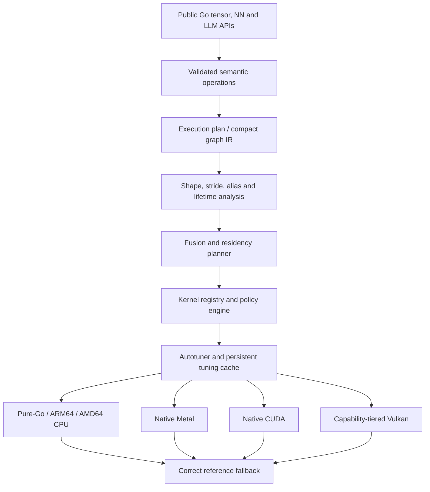
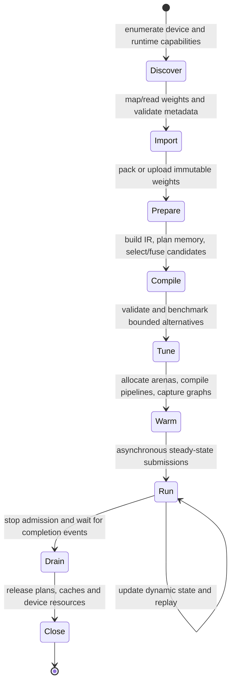

# GoAI Architecture Research — Performance Leadership

> Status: normative architecture research and implementation blueprint  
> Stand: 14 August 2026  
> Target: Go 1.26, pure-Go-first, optional Metal, CUDA and Vulkan backends  
> Local evidence: [`BENCHMARKS.md`](BENCHMARKS.md), [`SPEC.md`](SPEC.md),
> [`docs/benchmarking.md`](docs/benchmarking.md)  
> Citation policy: peer-reviewed work is cited by a canonical
> `https://doi.org/...` link. Preprints use their registered DataCite arXiv DOI.
> Books use publisher records because books commonly have no DOI. Standards,
> manuals and source repositories use their canonical versioned URL. No DOI is
> invented where none is registered.

## Terminology used throughout

- **AI** — artificial intelligence.
- **CPU / GPU** — central processing unit / graphics processing unit.
- **LLM** — large language model.
- **BLAS** — Basic Linear Algebra Subprograms, the standard dense linear-algebra
  operation families; **cuBLAS** is NVIDIA's CUDA implementation.
- **CUDA** — NVIDIA's GPU computing platform; **Metal** is Apple's native GPU
  programming platform; **Vulkan** is Khronos's cross-vendor graphics and
  compute API.
- **GEMM / GEMV** — general matrix-matrix multiplication / general
  matrix-vector multiplication.
- **SIMD** — single instruction, multiple data: one instruction processes a
  vector of values.
- **ARM64 / AMD64** — the 64-bit Arm and x86 processor architecture families;
  **AVX2** is Advanced Vector Extensions 2, **FMA** is fused multiply-add, and
  **AMX** here means Apple's matrix coprocessor commonly known by that name.
- **IR / ABI / API** — intermediate representation / application binary
  interface / application programming interface.
- **AOT / JIT / PGO** — ahead-of-time compilation / just-in-time compilation /
  profile-guided optimization.
- **KV cache** — key/value attention cache retained between generated tokens.
- **MoE** — Mixture-of-Experts, where only selected expert subnetworks process
  each token.
- **Q4_K / Q4_K_M** — ggml block-quantized weight formats in the four-bit
  storage class.
- **GGUF** — llama.cpp's single-file model and tensor container format.
- **RMSNorm / RoPE / SwiGLU** — Root Mean Square normalization / rotary
  position embedding / a sigmoid-weighted linear-unit feed-forward activation.
- **TTFT / ITL** — time to first token / inter-token latency.
- **SPIR-V** — Khronos's portable binary intermediate representation for
  shaders and compute kernels.
- **CTA** — cooperative thread array, NVIDIA's term for a CUDA thread block.
- **NVRTC / PTX / ISA** — NVIDIA Runtime Compilation / Parallel Thread
  Execution / instruction set architecture.
- **HAL** — hardware abstraction layer.
- **NN** — neural network.
- **NUMA** — Non-Uniform Memory Access, where memory latency depends on the CPU
  socket or memory node.
- **GFLOP/s** — billions of floating-point operations per second.

## Executive decision

GoAI should not define success as “faster than cuBLAS, BLAS, PyTorch,
llama.cpp and every other library everywhere.” That claim has no stable test
boundary: the result changes with hardware, operation, matrix shape, precision,
quantization, batch size, context length, workspace, compilation cost and
numerical tolerance.

The defensible goal is **performance leadership on declared workload cells**:

```text
hardware × model/operation × shape × dtype/quantization × batch/context × scope
```

For each cell, GoAI should target the best latency, throughput, memory use or
energy efficiency at equal numerical semantics. This turns an impossible global
claim into a falsifiable and publishable leadership matrix.

The recommended architecture is:

1. Keep the validated pure-Go reference backend as numerical truth and universal
   fallback.
2. Keep Go as the public application programming interface (API), graph planner,
   memory planner, scheduler and autotuning control plane.
3. Dispatch whole operations, fusion groups or captured graphs across the native
   boundary; never cross cgo per element, tile or microkernel.
4. Use vendor libraries for standardized dense primitives until a measured
   specialization wins. Concentrate custom kernels on fixed shapes,
   quantization, fusion, attention, Mixture-of-Experts (MoE), and complete decode
   steps.
5. Maintain separate native peak paths for Apple Metal and NVIDIA CUDA. Treat
   Vulkan as a capability-tiered portability backend, not as one universal
   shader expected to beat every vendor-native implementation.
6. Add a shape-, datatype-, device- and driver-keyed kernel registry and
   autotuner. Performance leadership requires selecting among implementations,
   not declaring one implementation universally optimal.

The performance principles come from cache-aware matrix multiplication
[P1, P2], the Roofline model [P3], input/output-aware attention [P4–P6], tiled
tensor compilers [P8], algorithm/schedule separation [P9], and automatic
cross-device schedule search [P10].

## 1. Scope and research questions

This document answers three questions:

1. Which architecture gives a Go-native AI library a credible path to
   performance leadership without sacrificing correctness or portability?
2. Which books, papers, specifications, profilers and source repositories should
   guide the Go, C, assembly, CUDA, Metal and Vulkan implementations?
3. Which benchmark contract is strong enough to support public claims against
   cuBLAS, BLAS implementations, PyTorch, llama.cpp and serving engines?

Out of scope:

- promising leadership on unmeasured hardware or workloads;
- weakening numerical semantics merely to produce a faster headline;
- replacing a mature vendor kernel without evidence of an exploitable workload
  specialization;
- making the optional accelerator stack a requirement for `CGO_ENABLED=0`.

## 2. Current measured position

The repository already contains unusually strong CPU results, but the open gaps
are concentrated in production GPU inference and fusion. The following table is
a navigation summary of the authoritative local measurements, not a new
benchmark result.

| Workload cell | Current evidence | Architecture implication |
|---|---:|---|
| M2 Pro, floating-point 32-bit (f32) GEMM, 1024³ | about 2,590 GFLOP/s versus about 2,584 for torch-cpu | Square CPU GEMM is not the highest-priority gap. Preserve it and focus on workload-level overhead. |
| M2 Pro, f32 GEMM larger than L2 cache | about 1,695 GFLOP/s versus 1,294 for Accelerate | The existing blocked/AMX path proves that targeted CPU specialization can win. |
| M2, TinyLlama-1.1B, four-bit class decode | GoAI 9.9 token/s versus llama.cpp 197 and MLX 231 | Native Metal Q4_K kernels, fusion and residency are the largest immediate opportunity. |
| RTX 3060, matched Q4_K-class decode | llama.cpp leads by about 1.19–1.27× in the measured cells | The remaining gap is small enough for fused dequantization, matrix-vector kernels and decode scheduling to matter. |
| RTX 3060, TinyLlama prefill, 128-token prompt | GoAI 5,600 token/s versus vLLM 10,729 | Fused input/output-aware attention is the primary CUDA prefill target. |
| M2 Pro training and vision workloads | roughly 2–4× training gap; some Vision Transformer cells much wider | Graph fusion, resident execution and removal of per-image dispatch are higher value than another isolated GEMM experiment. |

Source and exact caveats: [`BENCHMARKS.md`](BENCHMARKS.md). In particular, its
Apple standalone-matmul number includes a host round trip that resident workloads
avoid; [`SPEC.md`](SPEC.md), task T623, records the measured interpretation. All
new decisions must preserve the benchmark scope distinctions documented in
[`docs/benchmarking.md`](docs/benchmarking.md).

## 3. Performance thesis

### 3.1 Where a custom implementation can win

| Regime | Expected opportunity | Reason |
|---|---|---|
| Dense, standard GEMM at common shapes and precision | Low | cuBLASLt, Accelerate, BLIS and related libraries already search or encode highly tuned schedules. Parity is a success unless GoAI has a workload-specific advantage. |
| Fixed model shapes with non-standard epilogues | Medium to high | Bias, activation, normalization, quantization or routing can be fused, avoiding intermediate memory traffic and launches. |
| Small-M quantized decode | High | Decode is commonly bandwidth- and launch-sensitive. Fused dequantization plus matrix-vector/matrix-matrix work can remove weight expansion and intermediate writes. |
| Prefill and long-context attention | High | FlashAttention demonstrates that minimizing traffic between high-bandwidth memory and on-chip memory changes wall-clock performance without approximating attention [P4, P5]. |
| End-to-end graph versus eager framework execution | High | Capturing and fusing a stable graph removes allocation, dispatch, launch and synchronization overhead. |
| One generic Vulkan shader across all vendors | Low | Subgroup width, cooperative matrix shapes, memory hierarchy and driver compilation are implementation-dependent [D17–D20]. |

### 3.2 The governing models

**Cache-aware GEMM.** High-performance matrix multiplication is a hierarchy of
packing, register microkernels, cache blocking and parallel loop choices, not a
single triple loop [P1]. BLIS shows how most Basic Linear Algebra Subprograms
(BLAS) Level 2 and Level 3 work can be built around a small kernel set [P2].

**Roofline.** Every kernel should be classified by operational intensity and the
measured bandwidth/compute ceilings of the target device [P3]. This prevents
trying to solve a bandwidth-bound decode kernel with more theoretical floating
point throughput, or a launch-bound kernel with a wider vector.

**Input/output awareness.** FlashAttention's central lesson is that fewer reads
and writes can be more important than fewer arithmetic operations [P4].
FlashAttention-2 improves work partitioning and occupancy [P5];
FlashAttention-3 adds Hopper-specific asynchronous techniques [P6]. The latter
is a design reference, not a kernel to transplant onto the Ampere-class RTX 3060.

**Algorithm/schedule separation.** Halide, Triton and TVM show why tensor
semantics should be separate from tile sizes, fusion, vectorization, staging and
device mapping [P8–P10]. GoAI needs this separation even if it implements a
smaller and more controlled search space.

### 3.3 Quantitative cost model

Every proposed optimization must name the term it is intended to reduce. For a
single resident kernel, use the following first-order model:

```text
arithmetic_intensity I = useful_operations / bytes_moved_at_the_bottleneck

T_kernel ≈ T_launch
         + max(useful_operations / effective_compute_rate,
               bottleneck_bytes / effective_bandwidth)
         + T_required_synchronization
```

`effective`, rather than specification-sheet peak, is deliberate. A calibration
suite must measure sustainable memory bandwidth, cache bandwidth, integer,
floating-point and matrix-instruction throughput for each device and numerical
mode. The Roofline comparison then predicts whether the next experiment should
reduce traffic, expose more parallel work, use specialized arithmetic or remove
launch/synchronization overhead [P3, B1, B2].

For a graph or model step, use the critical path rather than summing idealized
kernel times:

```text
T_step = critical_path(
    transfers + conversions + packing + allocation + launches
    + kernels + collectives + synchronization
)
```

Independent work may overlap, but the benchmark must prove that overlap on the
timeline; it must not subtract transfer or launch time merely because an API is
asynchronous. End-to-end speedup is bounded by the fraction that remains
unoptimized, so isolated 10× microkernel gains can be irrelevant when that kernel
occupies only a small share of the production critical path. This is the
practical use of Amdahl's law and quantitative design advocated by *Computer
Architecture: A Quantitative Approach* [B2].

The selector optimizes subject to hard constraints, in this order:

1. semantic validity and numerical error budget;
2. device capability, memory safety and workspace budget;
3. deterministic/reproducible mode requirements;
4. the declared objective: latency, throughput, memory or energy;
5. secondary objectives and cold-start cost.

Candidates outside a hard constraint are rejected rather than assigned a large
penalty. Among valid candidates, the default serving objective is lexicographic:
meet a configured tail-latency service-level objective, then maximize sustained
tokens per second, then minimize peak memory. A user may instead request
minimum single-request latency, minimum energy or deterministic execution. This
prevents an autotuner from silently buying a small throughput gain with an
unacceptable accuracy, latency or memory regression.

### 3.4 What the long-form sources change in this design

The books are used as architecture inputs, not decorative citations:

| Source | Distilled design consequence |
|---|---|
| *Programming Massively Parallel Processors* [B1] | Every GPU candidate declares coalescing, on-chip reuse, thread/cooperative-group mapping, synchronization, register/shared-memory use and occupancy. Double buffering and software pipelining are alternatives to tune, not universal defaults. |
| *Computer Architecture: A Quantitative Approach* [B2] | Optimize measured common cases, use Amdahl's law, model locality and bandwidth explicitly, and evaluate cost/performance rather than peak arithmetic alone. |
| *Efficient Go* [B3] | Treat CPU, memory, allocations and garbage collection as resource budgets; start from production profiles; reduce work, reuse state and recycle storage only where ownership remains explicit. The local copy is a 2022 third early release, so final-edition chapter coverage is verified against the publisher record rather than inferred from absent local pages. |
| *Systems Performance* [B4] | Use a scientific hypothesis→measurement→change→retest loop; pair workload characterization with USE (utilization, saturation, errors) and RED (rate, errors, duration) telemetry; report distributions and tails, not only averages. |
| *Modern C* [B5] | Keep a narrow C ABI with exact prototypes, explicit preconditions, opaque handles, defined object lifetimes and release/acquire synchronization. Do not expose C object layout or rely on aliasing and lifetime assumptions across Go/native boundaries. |

No copyrighted text or implementation is copied from these sources. The design
below is a technical synthesis intended to make the decisions usable without
having the books open.

## 4. Target architecture



### 4.1 Semantic operation layer

The reference operation defines shape rules, dtype behavior, accumulation
precision, aliasing, edge cases and tolerated error. Optimized backends may
change schedules and intermediate representations, but not the declared
semantics without selecting a separately named numerical mode.

This preserves the project's existing reference-first and parity gates in
[`SPEC.md`](SPEC.md), goals G3–G6 and constraints C1–C6.

### 4.2 Compact graph intermediate representation

The intermediate representation (IR) does not need to become a general-purpose
compiler initially. It needs enough information to:

- represent operations, tensor views, dependencies and side effects;
- retain symbolic or bucketed dimensions relevant to prompt and batch lengths;
- prove when buffers may alias or be reused;
- identify legal fusion groups;
- keep weights and key/value (KV) caches resident;
- carry numerical requirements and workspace limits;
- choose a backend for an operation, layer or fusion group;
- record capture/JIT eligibility and cache keys.

The IR should express **what** is calculated; schedules stored in the kernel
registry express **how** it is calculated. This follows the separation supported
by Halide, Triton and TVM [P8–P10].

### 4.3 Kernel registry

Each implementation should be selected through a structured key rather than
backend-specific conditionals spread across public code.

```text
KernelKey = {
    op/fusion signature,
    device and feature set,
    dtype and accumulation mode,
    quantization and layout,
    shape or shape bucket,
    alignment and stride class,
    workspace budget,
    deterministic/fast numerical mode
}
```

Each candidate records:

- support predicate;
- estimated setup and steady-state cost;
- required packing and workspace;
- correctness tolerance and validation test;
- cold and warm benchmark evidence;
- implementation version/hash;
- fallback candidate.

### 4.4 Memory and residency planner

The planner should own tensor lifetimes, temporary arenas, prepacked weights,
device residency, KV-cache pages, asynchronous transfers and low-memory
offloading. PagedAttention demonstrates that memory allocation and fragmentation
policy are part of LLM serving performance, not merely infrastructure [P7].

For GoAI, the planner must also preserve the existing low-video-memory behavior:
device overflow should fall back to CPU layers rather than turn into a hard
failure. Backend splitting remains explicit and measurement-driven as required
by constraints C23–C24 in [`SPEC.md`](SPEC.md).

### 4.5 Go/native boundary

Go remains responsible for safe ownership, graph construction, scheduling,
policy, telemetry and public API ergonomics. Native backends should expose a
small stable C application binary interface (ABI) with opaque handles for:

- device/context creation;
- buffer allocation/import/export;
- compiled kernel or graph creation;
- whole-operation/fusion-group execution;
- asynchronous submit, event and wait;
- profiling timestamps and error retrieval.

The boundary must not be crossed per element, output row, tile or microkernel.
For a stable decode graph, one Go call should ideally submit one complete step or
one previously captured graph.

### 4.6 Non-negotiable architecture invariants

These rules are the contract against which all later implementation choices are
reviewed:

| ID | Invariant | Enforcement |
|---|---|---|
| A1 | `CGO_ENABLED=0` remains correct and useful. | Pure-Go reference and optimized CPU test suites run in continuous integration; accelerator packages remain optional/build-tagged. |
| A2 | There is one semantic definition for each operation. | Shape, dtype, accumulator, rounding, aliasing, empty-tensor and error behavior are tested against `backend/ref`; fast modes are explicitly named. |
| A3 | No silent host fallback in a claimed resident workload. | Compiled plans list every placement and transfer; a benchmark fails if an unexpected fallback or synchronization occurs. |
| A4 | The hot loop performs no unplanned allocation, compilation, tuning or host/device copy. | Plan warm-up freezes arenas, kernels and graph instances; runtime counters assert zero events after warm-up. |
| A5 | Device resources have explicit owners and completion-aware lifetimes. | Buffers are released only after their last event/fence; opaque native handles are idempotently closable; finalizers are leak backstops, never the normal path. |
| A6 | Capability checks precede specialization. | Candidate support predicates consume a normalized device fingerprint; unsupported features never reach launch. |
| A7 | Every optimized path has a correct fallback and a non-vacuity test. | Differential tests prove both equivalence and that the intended candidate executed. |
| A8 | Performance policy is data, not scattered conditionals. | Selection is performed by the registry/cost model; backend code implements candidates but does not own global policy. |
| A9 | Cache entries are content- and environment-addressed. | Kernel, compiler, driver, device, numerical contract and plan schema hashes participate in the key. |
| A10 | Public leadership claims are generated from reproducible manifests. | No manually transcribed headline is authoritative; raw samples, environment and competitor commands remain linked. |

These invariants extend the existing pure-Go-first, correctness-first and
zero-configuration rules in [`SPEC.md`](SPEC.md). They also prevent the common
failure mode where a fast benchmark path exists beside, but not inside, the
production execution path.

### 4.7 Current repository to target architecture

GoAI already has many of the necessary mechanisms. The architectural task is to
make them uniform and composable.

| Existing mechanism | Current role | Required evolution |
|---|---|---|
| [`backend.Backend`](backend/backend.go) and [`backend.Execute`](backend/execute.go) | Per-operation dispatch, typed attributes, CPU/reference fallback and autograd interception. | Retain as eager/debug execution. Add a compiled-plan route at the same choke point without changing eager semantics. |
| [`backend.IntoBackend`](backend/backend.go) | Optional caller-owned outputs through `ExecuteInto`. | Generalize into plan-assigned buffer slots so every hot intermediate is caller/arena-owned. |
| [`backend.QuantMatMuler`](backend/quant.go) and resident weights | Optional quantized and uploaded-weight fast paths. | Replace model-specific probing with registry capabilities and one lifetime-managed `PreparedWeight` abstraction across CPU, Metal, CUDA and Vulkan. |
| [`backend.MemoryProber`](backend/offload.go) and `PlanOffload` | Measured budget plus layer placement with CPU fallback. | Include weight layout, KV growth, activation scratch, transfer topology, safety headroom and placement cost; keep the current simple plan as fallback. |
| [`backend/cuda/cuda_graph.go`](backend/cuda/cuda_graph.go) | Stream capture and executable graph replay. | Own graphs through compiled plans, bucket dynamic inputs and update parameters only where CUDA permits [D27]. |
| CUDA paged KV and batch scheduler | Device block pool, per-sequence tables and iteration-level admission. | Move the policy above CUDA, retain backend-native storage/attention kernels, add prefix sharing, preemption and service-level scheduling. |
| Metal/CUDA/Vulkan recorders | Batch multiple device operations without per-op host synchronization. | Implement a common `CommandPlan` contract with backend-specific lowering and event semantics. |
| [`tensor.Allocator`](tensor/allocator.go) | Heap or power-of-two host pooling; requested over-alignment is advisory. | Introduce aligned host arenas, pinned/staging pools and backend device arenas while preserving the existing interface as the eager default. |

The migration is additive: eager operation calls remain available for
correctness, interactive development and variable graphs. Stable inference and
training steps opt into compilation, and the library can later auto-promote a
frequently repeated eager trace after it proves shape and side-effect stability.

### 4.8 Execution lifecycle

A production execution has eight explicit phases:



The user-facing convenience API may perform the early phases automatically, but
the phases remain observable and individually controllable. In particular:

- import may be lazy, but model metadata and byte ranges are validated before a
  kernel can consume them;
- preparation is keyed by source tensor identity/content, target layout and
  device, so immutable weights are packed or uploaded once;
- compile never benchmarks; it constructs legal candidates and a safe fallback;
- tune may be disabled, time-bounded or delegated to a build farm;
- warm-up performs the allocations and compilation that would contaminate
  steady-state latency;
- run accepts only inputs compatible with the plan's shape contract, or routes
  to a different bucket/eager fallback;
- drain establishes completion before destruction. `Close` is idempotent and
  reports deferred device errors.

### 4.9 Minimal graph IR and legality model

The first graph IR should be a typed, acyclic dataflow representation, not a new
general programming language. Loops whose trip counts belong to the model, such
as transformer layers, are expanded or represented as reusable subplans;
runtime request scheduling stays outside the pure tensor graph.

Illustrative schema:

```go
type ValueID uint32
type NodeID uint32

type ValueDesc struct {
	DType      DType
	Shape      []Dim // constant, bounded symbolic or bucketed
	Strides    []int64
	Layout     LayoutID
	Device     DeviceID
	Mutability Mutability // immutable, scratch, stateful
	AliasSet   uint32
	Alignment  uint32
	Quant      *QuantDesc
}

type Node struct {
	ID       NodeID
	Op       Op
	Inputs   []ValueID
	Outputs  []ValueID
	Attrs    TypedAttrs
	Effects  EffectSet // RNG, state write, transfer, collective
	Numerics NumericContract
}
```

The real implementation should use compact indexed slices and interned immutable
descriptors rather than maps or interface-heavy objects in the runtime hot path.
The schema is shown to fix semantics, not memory layout.

A transformation is legal only when it proves all of the following:

1. output shapes, dtypes and observable values satisfy the numerical contract;
2. no read is moved after an aliasing write and no stateful effect is reordered;
3. reductions preserve the required determinism/accumulation mode;
4. the fused candidate supports every stride, alignment and quantization
   precondition, or the planner inserts an explicit conversion;
5. peak live memory and workspace fit the selected placement budget;
6. the transformed graph has a complete fallback decomposition.

Core passes, in order:

1. validation and canonicalization;
2. constant folding of metadata and shape arithmetic;
3. view/transpose propagation without copying where kernels accept the layout;
4. pattern recognition for semantic fusion groups;
5. placement and explicit transfer insertion;
6. lifetime/alias analysis and arena assignment;
7. candidate enumeration plus analytical pruning;
8. schedule selection/autotuning;
9. backend lowering, capture and final plan validation.

The canonical IR remains hardware-neutral; a lowering may create backend
schedule IR containing tile sizes, pipeline stages and bindings. This preserves
the algorithm/schedule separation demonstrated by Halide, Triton and TVM
[P8–P10].

### 4.10 Kernel candidate contract

The registry needs more than `Kernel(op, dtype)`. The target internal contract
is conceptually:

```go
type Candidate interface {
	ID() CandidateID
	Supports(DeviceCaps, Problem, NumericContract) RejectReason
	Estimate(Calibration, Problem) CostRange
	Workspace(Problem) MemoryRequirement
	Prepare(PrepareContext, Problem) (PreparedCandidate, error)
	Validate(ValidationContext, PreparedCandidate) error
}

type PreparedCandidate interface {
	Submit(Stream, Bindings) (Event, error)
	Close() error
}
```

`Supports` is pure and cheap. `Estimate` prunes candidates but never serves as
benchmark evidence. `Prepare` may pack, compile or instantiate and is outside
the hot path. `Submit` is asynchronous unless the CPU implementation is
intrinsically synchronous. Error classes distinguish unsupported, resource
exhausted, compilation failure, invalid input and device loss so the policy can
choose a safe fallback without hiding real faults.

Candidate metadata contains semantic signature, supported shape predicates,
layout/alignment, input/output alias policy, accumulator, determinism, scratch,
capture compatibility, backend implementation hash and provenance. Provenance
identifies native source, generated source, vendor library call or external
artifact and its license. This is necessary both for reproducibility and for
safe cache invalidation.

### 4.11 Normalized capability fingerprint

Backend registration currently establishes presence. Compiled planning also
requires a stable fingerprint:

```text
identity: backend, vendor, architecture/family, device UUID/model
runtime: driver, API/runtime, compiler and shader/kernel ABI versions
compute: vector/subgroup/warp width, integer/fp types, dot/matrix instructions
limits: threads, workgroup/CTA, registers, shared/threadgroup memory, queues
memory: heaps, host visibility/coherency, alignment, budget, peer access
execution: graph/capture, timestamps, subgroup control, cooperative matrices
numerics: supported accumulators, denormal/rounding behavior, deterministic modes
```

The fingerprint is serialized in canonical field order and hashed. Optional
fields remain explicit `unknown`, never zero-valued guesses. CUDA compute
capability, Apple GPU family and Vulkan feature/property chains are backend
inputs to the same logical record. On Vulkan, subgroup size and cooperative
matrix shapes are queried properties, not assumptions [D18, D20, D29, D30].

### 4.12 Plan, compilation and tuning caches

Separate caches have different validity boundaries:

| Cache | Contains | Minimum invalidation inputs |
|---|---|---|
| Weight preparation | packed/converted host bytes or device upload recipe | source content/identity, quant/layout, candidate version, device ABI |
| Compilation | cubin/fatbin, Metal library/archive slice, SPIR-V/pipeline data | source hash, compiler flags/version, device/runtime compatibility, numerical mode |
| Tuning | winning candidate and measured distribution | full problem key, capability fingerprint, implementation hashes, objective and workspace |
| Plan | lowered graph, arena slots, binding schema, selected candidates | semantic graph hash plus all dependent cache digests |
| Runtime state | graph instance, command buffers, KV pages, events | process/context only; never assumed portable across runs |

Persistent entries use a versioned header, checksum and atomic replace. The
reader treats corruption, unknown schema or incompatible environment as a cache
miss. Cache files never contain unvalidated native pointers. Vulkan's own
pipeline-cache header already captures vendor ID, device ID and
`pipelineCacheUUID`; GoAI retains and verifies those fields inside its broader
key [D30]. Metal binary archives may accelerate pipeline creation, but their
device-specific compiled slices remain separate from the portable tuning record
[D28].

### 4.13 Memory, residency and transfer architecture

Memory is planned at four levels:

1. **model source:** memory-mapped or streamed file ranges, metadata and
   checksums;
2. **prepared immutable state:** CPU packs, quant blocks and device-resident
   weights;
3. **session state:** KV pages, prefix-cache pages, optimizer state and random
   number generator state;
4. **step scratch:** activation arenas, reduction workspace, staging buffers and
   command parameters.

Every buffer has an owner, placement, byte size, alignment, last-use event and
eviction class. The planner computes liveness intervals and assigns compatible
non-overlapping values to arena slots. Aliasing is explicit; an in-place kernel
may reuse a slot only when its candidate contract permits the exact input/output
relationship. GPU frees are deferred until the completion event, while host
pooled memory is returned only after no native call can retain its address.

Immutable weights use this state machine:

```text
file range -> validated view -> optional host pack/convert
           -> device upload -> resident prepared weight -> event-safe release
```

The source view can be evicted after upload unless required for CPU fallback.
If CPU fallback must remain possible, retain a mapped quantized representation
rather than a second fully dequantized copy. The preparation key includes the
logical tensor, byte range/content digest, quantization metadata, transposition,
packing version and device.

KV memory is block/page based. Page size is tuned against internal
fragmentation, table traffic, coalescing and allocation frequency. The control
plane tracks free, private, shared-prefix and evictable pages. A sequence table
maps logical token blocks to physical pages; copy-on-write occurs when a shared
prefix gains a divergent continuation. Admission reserves a bounded growth
budget, and preemption releases or spills the least valuable state according to
the configured policy. PagedAttention establishes why this policy is integral
to serving capacity and throughput [P7]; the existing CUDA paged pool proves the
storage mechanism locally but must lose its static-f16-shadow limitation before
production use.

Low-memory placement estimates:

```text
required = prepared_weights + fixed_runtime + active_KV_budget
         + peak_step_scratch + compilation_workspace + safety_headroom
```

The planner first reduces optional workspace, then evicts cold prepared objects,
then lowers KV/cache precision if and only if the numerical mode permits it,
then offloads whole contiguous layer ranges. Whole-layer transfers are preferred
over per-operation bouncing because transfer cost and synchronization commonly
dominate split compute. The existing `PlanOffload` remains the correctness
fallback, while a topology-aware planner measures link bandwidth/latency and
minimizes boundary crossings.

Go heap pointers must not become long-lived native device-state identities.
Long-lived native resources are represented by opaque handles; transient host
buffers are pinned or copied according to the platform's legal interoperation
rules. C-side objects never retain a Go pointer after the call. The lifetime,
prototype and aliasing discipline follows the principles summarized from
*Modern C* [B5].

## 5. CPU architecture: Go, C and assembly

### 5.1 Layered CPU implementation

1. Scalar pure-Go reference kernel.
2. Typed zero-allocation Go kernel with invariants hoisted out of loops.
3. Packed and blocked kernel following Goto/BLIS decomposition [P1, P2].
4. Architecture-specific register microkernels:
   - ARM64 Advanced SIMD, commonly called Neon, for Apple Silicon [D4];
   - AMD64 AVX2/FMA and later feature-specific paths guided by vendor manuals
     [D5–D7].
5. Shape-specific kernels for GEMV, small-M GEMM, batched GEMM, quantized dot
   products and fused epilogues.
6. Thread-pool, affinity and Non-Uniform Memory Access (NUMA) policy only after
   the single-core microkernel and packing path are near their Roofline ceiling.

### 5.2 Rules for Go hot paths

- `ExecuteInto`-style caller-owned outputs for allocation-free repeated work;
- dtype dispatch once outside inner loops;
- no interface conversion, closure call, bounds recomputation or index unravel
  per element;
- prepack immutable weights and cache packing by weight identity plus layout;
- specialize tails separately from the aligned main loop;
- use representative production profiles for profile-guided optimization (PGO),
  as recommended by the Go documentation [D2];
- use assembly only when profiles and instruction analysis demonstrate a
  compiler miss; retain a portable fallback and differential test.

### 5.3 CPU study and oracle implementations

- Goto/van de Geijn [P1] and BLIS [P2, S1] for the loop hierarchy;
- BLISlab [S2] for experiments rather than production code reuse;
- OpenBLAS [S3] as a broad BLAS baseline;
- oneDNN [S4] for primitive caching, post-operations and just-in-time (JIT)
  specialization;
- XNNPACK [S5] for inference microkernels, packing and mobile CPU behavior;
- LIBXSMM [S6] for small fixed-shape and batch-reduce GEMM specialization;
- Go assembler, diagnostics, PGO and benchstat [D1–D3].

### 5.4 Shape router and GEMM decomposition

CPU matrix multiplication needs distinct regimes rather than one block policy:

| Regime | Primary kernel | Dominant concern |
|---|---|---|
| `M=1` decode | GEMV / multiple-output dot products | stream packed weights once, amortize activation loads, parallelize without reduction overhead |
| small `M` | small-M packed GEMM | balance packing cost against reuse; fuse bias/activation/quant output |
| medium/large dense | cache-blocked GEMM | register reuse, cache panels, parallel loop and packing |
| skinny/tall | shape-specific panel kernel | avoid padding and poor work distribution |
| batched fixed small matrices | batch-reduce/direct microkernel | remove call and packing overhead; reuse generated schedule |

For conventional GEMM `C[M,N] += A[M,K] * B[K,N]`, use the Goto/BLIS loop
hierarchy: pack cache-sized panels, call a register microkernel over `MR×NR`
tiles, and assign parallel work at the outermost loop that supplies enough
independent tiles without duplicating packing [P1, P2]. `MC`, `NC`, `KC`, `MR`
and `NR` are candidate parameters keyed by architecture and dtype, not constants
copied from another processor. The analytical filter rejects a tile when its
packed panels exceed the intended cache, its register accumulator cannot fit,
or its worker count leaves excessive tail imbalance.

The shape router is generated from predicates in the registry. An illustrative
order is exact fixed-shape winner, GEMV/small-M family, architecture packed GEMM,
vendor BLAS candidate, then portable Go. The router records why each earlier
candidate was rejected and exposes that explanation to diagnostics. Tests cover
predicate boundaries so `M=4` cannot accidentally route to a kernel validated
only for `M=1`.

### 5.5 Packing, quantization and fused CPU kernels

Packing is a prepared-weight transformation, not repeated operation overhead.
Packed headers specify format version, logical dimensions, dtype/quant type,
block sizes, alignment, tail padding and the candidate family that consumes the
data. Padding bytes are initialized so vector tail loads cannot observe
uninitialized memory.

Decode kernels should compute several output channels per activation traversal.
For block-quantized weights they load scales and packed values, expand only into
registers/vector lanes, accumulate at the declared precision and never
materialize a full floating-point matrix. Candidate families include each GGUF
block format actually used by production models; unsupported formats route to a
correct scalar/block decoder. The current local benchmark showing quantized CPU
decode slower than f32 is a proof that storage compression alone is insufficient:
dequantization must be inside a vectorized dot-product path.

Fused CPU patterns are intentionally small and reusable:

- GEMM/GEMV plus bias and activation;
- QKV projection into its final interleaved or banded layout;
- RMSNorm plus quantization of the next linear input;
- SwiGLU gate/up activation before down projection;
- RoPE plus KV write;
- softmax plus sampling primitives where the vocabulary remains cache-resident.

Fusion is rejected when it prevents weight reuse, creates an excessive code-size
matrix or makes the common vectorized interior slower. The unfused
`ExecuteInto` chain remains the fallback.

### 5.6 Assembly boundary and calling convention

The portable Go implementation is the executable specification for an assembly
microkernel. An assembly kernel receives raw base pointers, exact lengths and a
plain parameter block; validation, dtype routing, nil handling and tail selection
happen in Go. It must not call back into Go or allocate. Each assembly file has:

- an architecture/feature build constraint and runtime feature predicate;
- a documented register map, clobber set, alignment and overread policy;
- a vectorized main loop and tested scalar/masked tail;
- randomized differential tests, guard-page or canary tests and race-enabled
  concurrency tests;
- instruction and benchmark evidence explaining why compiler output was
  insufficient.

ARM64 candidates begin with Neon and may include the existing Apple matrix path
only behind Apple/OS capability checks. AMD64 begins with AVX2/FMA on the known
Zen-class host and adds AVX-512 or later extensions as separate candidates,
never as build-wide assumptions. Arm, Intel and Agner Fog manuals provide the
instruction and microarchitecture constraints [D4, D5, D7]; emitted code is
verified rather than presumed from source.

### 5.7 Concurrency, affinity and NUMA

Use a library-owned bounded worker pool for large CPU kernels. Creating
goroutines per tile or letting every layer start an independent pool causes
oversubscription and scheduler noise. A plan declares its maximum worker count,
parallel loop, grain size and whether callers may execute multiple plans
concurrently.

On one socket, partition output tiles so workers write disjoint cache lines and
reuse shared packed read-only panels. On NUMA systems, first-touch or explicitly
place packed weights and scratch near their owning workers; replicate small
read-mostly metadata where that is cheaper than remote access. Tune thread
count, affinity and simultaneous multithreading by workload cell. A higher core
count is not accepted if tail latency or memory saturation worsens. CPU
utilization, run-queue delay, migrations, cache misses and memory bandwidth are
observed using the whole-system method in [B4], while Go scheduler, allocation
and blocking profiles follow [B3].

Nested parallelism is disabled by default. If GoAI calls a vendor BLAS, it either
lets that library own the threads or selects a single-threaded call inside the
GoAI pool; it does not multiply the two pools.

### 5.8 CPU autotuning and acceptance

The per-host calibration suite records sustainable bandwidth per memory level,
vector/matrix throughput, core topology and timer stability. CPU tuning then
searches only candidates compatible with those limits. It measures packing
separately and includes it in the operation scope according to expected weight
reuse.

A CPU candidate ships only when it passes:

1. pure-Go reference parity over normal, tail, empty and adversarial values;
2. sanitizer/canary-style bounds checks for native/assembly code;
3. deterministic repeated execution where the numerical mode promises it;
4. no-allocation steady-state assertion for prepared paths;
5. statistically supported improvement on its declared cell and no material
   regression in neighboring routed cells;
6. a disassembly/counter explanation consistent with the proposed mechanism.

PGO is applied after stable workload-level profiles exist, not as a substitute
for removing interface dispatch, allocation or poor algorithms. Go's PGO and
`benchstat` documentation define the supported build and statistical tools
[D2, D3].

## 6. Apple M2 and native Metal

The current production decode gap makes Metal the highest-value backend.
Apple's feature tables identify M2 as Apple GPU family 8 and document the
available SIMD-group matrix facilities [D8]. Performance work should be guided
by the Metal Shading Language specification and actual GPU counters rather than
API-level timing alone [D9–D12].

### 6.1 Immediate Metal targets

1. Fused Q4_K/Q4_K_M dequantization plus matrix-vector or small-M matrix
   multiplication. Do not materialize a full floating-point weight matrix.
2. Decode-specialized kernels for matrix-vector multiplication, rotary position
   embedding (RoPE), KV write, normalization and gated activations.
3. Input/output-aware attention with online softmax and tiled KV traversal,
   adapted from the algorithmic principles in [P4, P5].
4. Stable GPU residency for weights, KV caches, activations and logits staging.
5. Reusable pipelines, argument layouts, command buffers or indirect command
   paths where the Metal API and workload permit them.
6. Shape bucketing for prefill so graph compilation is amortized without
   compiling a new graph for every exact prompt length.
7. Batched Vision Transformer execution that eliminates the current per-image
   dispatch loop.

### 6.2 Reference implementations

The MLX Metal backend [S7] and llama.cpp Metal backend [S8] are the two most
important executable references. Study their layout, graph fusion, pipeline
cache, quantized kernels and command submission. Pin a commit before recording
behavior or benchmarks because both repositories evolve continuously.

Vulkan through MoltenVK remains useful for portability testing, but native Metal
is the performance path for Apple Silicon [D8–D12, S13].

### 6.3 Metal execution architecture

The current `Recorder` proves that a complete sequence of resident operations
can share one command buffer and one final wait. Productize it as the Metal
lowering of `CommandPlan`:

```text
Go plan bindings
  -> stable Metal buffer/offset table
  -> encode prepared pipelines into one or a bounded set of command buffers
  -> commit without host wait
  -> signal completion event/callback
  -> recycle arena only after completion
```

There are three execution modes:

1. **eager diagnostic:** existing per-op `backend.Execute`, including fallback;
2. **recorded dynamic:** encode a command buffer for the current bucket while
   retaining resident buffers and avoiding per-op commits;
3. **prepared replay:** reuse pipeline states, argument layouts and a stable
   command template/encoder path for decode or a fixed training step.

The selector chooses the simplest mode that meets the target. A mechanism such
as indirect commands is not automatically faster; it must reduce measured CPU
encoding/launch time without introducing worse synchronization or resource
limits. Metal command buffers stay backend-native because their exact reuse and
mutation rules are not portable abstractions.

Pipeline states are compiled during prepare/warm-up and stored by full function
constant/tile/dtype signature. Metal binary archives hold device-specific
compiled slices to reduce later pipeline construction cost; a missing or stale
slice is a cache miss, never a reason to skip validation [D28]. Compile and
archive cost is reported in the cold-start scope.

### 6.4 M2 quantized linear design

The immediate Q4_K/Q4_K_M kernel family is divided by `M`:

- `M=1`: one or several SIMD-groups cooperate on output-channel blocks; weights
  are streamed once, scales/minima decoded into registers, the activation row is
  reused from cache/threadgroup memory where profitable, and partial sums are
  reduced without an intermediate dequantized tensor;
- small `M`: reuse each decoded weight block across several activation rows and
  map rows/output tiles to SIMD-groups;
- larger `M`: compare a custom fused path with preconversion plus MPS/Metal
  matrix primitives, including the amortized conversion and memory cost.

Candidate parameters include output channels per threadgroup, K-blocks per
iteration, vector load width, activation staging, SIMD-groups per threadgroup,
unroll and accumulator. The support predicate checks block divisibility,
alignment and GPU family. The tuner records thread occupancy, SIMD occupancy,
threadgroup-memory use, cache/memory traffic and duration via Metal counters
[D10–D12]. A variant is rejected if its apparent API timing gain disappears in
GPU timestamps or end-to-end decode.

Prepared quantized weights preserve the GGUF block semantics or convert once to
a documented Metal-optimal layout. Conversion is accepted only when:

```text
prepare_cost / expected_reuse_count + steady_state_cost
    < direct_format_steady_state_cost
```

and the converted copy fits the resident-memory budget. The original quantized
mapping remains available for CPU fallback unless policy explicitly releases it.

### 6.5 Metal attention and transformer fusion

Prefill uses a tiled exact-attention kernel with online row maxima and
normalizers so the score matrix is not written to device memory. Query tiles
traverse K/V tiles, apply causal or sliding-window bounds before loads where
possible, update stable softmax statistics, and accumulate output tiles. Tile
shape, SIMD-group mapping, K/V layout and precision are tuned separately for
head dimension and sequence bucket. This implements the input/output-aware
algorithmic idea of FlashAttention; it is not a source-level port [P4, P5].

Decode attention is a different kernel: one or a small batch of queries streams
the paged/contiguous KV cache and is usually bandwidth sensitive. It needs GQA
mapping, vectorized K dot products, online softmax, V accumulation and optional
sliding window in one dispatch. Long-context partitioned reductions are a
candidate only when enough parallel work cannot otherwise fill the GPU.

Preferred transformer fusion boundaries are:

```text
RMSNorm -> QKV quantized projection -> paired RoPE -> KV append
decode attention -> output projection with residual accumulation
RMSNorm -> gate/up projection -> SwiGLU -> down projection with residual
```

The first implementation may chain these inside one command buffer while still
using multiple kernels. Source/kernel fusion is introduced only where counter
evidence shows that removed traffic/launches outweigh occupancy loss. The
existing `MatMulAcc`, `RoPEPair`, `QMatMulResident`, blit/copy and recorder APIs
already establish several of these lower-level operations.

### 6.6 Unified-memory discipline and synchronization

Apple Silicon's shared physical memory does not make synchronization, residency
or copies irrelevant. The plan distinguishes CPU-written staging, GPU-private
hot state and shared/managed resources according to Metal storage and cache
rules. It avoids CPU reads of intermediates, batches uploads, and does not wait
until logits or another declared host boundary are required. GPU counters and
Metal validation establish actual behavior [D8–D12].

Two or more in-flight command buffers may overlap host encoding with GPU work.
Arena generations prevent the host from overwriting bindings still in use. Each
submission returns an event token; waiting is performed at semantic boundaries,
not implicitly after every operation. Errors from asynchronous completion are
attached to the plan/run that submitted the work.

### 6.7 Metal completion gates

Metal work is ordered by end-to-end impact:

| Gate | Required evidence |
|---|---|
| M1 resident Q4 path | Production `QuantLlama` uses resident Q4_K/Q4_K_M kernels with no per-layer host round trip; parity and non-vacuity pass. |
| M2 single-buffer decode | One decode step uses one bounded recorder/command plan, zero hot allocations and one semantic wait. |
| M3 attention | Tiled prefill and fused/paged decode attention beat the previous path across head/context buckets without numerical-mode changes. |
| M4 graph-level fusion | Residual and QKV/RoPE/KV patterns show reduced dispatch/traffic in counters and model-level gain. |
| M5 serving/vision | Continuous batching and true batched ViT eliminate request/image host loops; tails and memory are reported. |
| M6 leadership publication | Matched MLX and llama.cpp manifests show wins in named cells; losing cells remain published as gaps. |

The current roughly 20–23× TinyLlama decode gap is too large to close with a
single shader tweak. Gates M1–M3 remove the architectural causes—non-optimal
quantized compute, dispatch and attention—before last-mile instruction tuning.

## 7. NVIDIA CUDA

The RTX 3060 is an Ampere-class, compute-capability 8.6 target. Its backend must
be tuned as an Ampere backend; Hopper- and Blackwell-specific scheduling should
remain separate [D15].

### 7.1 Vendor path first

For standard dense GEMM, call cuBLASLt directly, enumerate compatible
algorithms, measure the best candidates under the real workspace constraint,
and cache the result [D16]. PyTorch eager matmul is not a substitute for this
baseline.

Use CUTLASS and CuTe as the executable reference for hierarchical Tensor Core
tiling, layout algebra, staging, split-K/stream-K choices and fused epilogues
[D14, S9]. Use Nsight Compute to classify Roofline position, warp stalls,
occupancy, tensor utilization, register pressure and memory traffic [D13].

### 7.2 Custom CUDA winner zones

- small-M quantized GEMV/GEMM;
- fused dequantization plus matmul;
- Root Mean Square normalization (RMSNorm) plus quantization;
- RoPE plus KV-cache write;
- fused SwiGLU activation;
- paged/ragged decode attention;
- grouped MoE kernels;
- a captured CUDA Graph for the complete decode step;
- FlashAttention-2-style prefill adapted to Ampere [P5].

### 7.3 Ahead-of-time plus JIT

Ship common device/model combinations as ahead-of-time (AOT) cubins or fatbins.
Compile uncommon shapes through NVIDIA Runtime Compilation (NVRTC), then cache
the compiled result [D21, D22]. The cache key must include at least:

```text
kernel source/hash + compute capability + driver/toolkit compatibility
+ dtype/accumulator + layout + shape/bucket + fusion epilogue + numerical mode
```

Hand-written Parallel Thread Execution (PTX) assembly is a last-mile tool. Use it
only after generated machine code and profiler evidence prove that CUDA C++ or
CUTLASS cannot express the required schedule [D22].

### 7.4 CUDA stream, allocator and graph model

Each device context owns non-blocking compute/copy streams, an event pool, a
stream-ordered device allocator or equivalent arena, library handles bound to
the active stream, and per-context error state. Prepared weights and plans are
shareable only when the CUDA context and ownership rules permit it; a request
never mutates global stream state.

Stable decode plans are captured only after all device allocation, pipeline/JIT
compilation and lazy initialization have completed. Capture-safe asynchronous
operations run on the captured stream, and no host synchronization occurs
inside capture. CUDA defines graph construction, instantiation and repeated
execution as separate stages and prohibits synchronous operations during
capture [D27]. The current `CaptureBegin`/`CaptureEnd` implementation already
pins the goroutine to its operating-system thread; the plan layer must own this
constraint so arbitrary callers cannot violate it.

Graph keys include model-plan hash, batch/context bucket, pointer-stability
class and selected candidates. Dynamic scalars and addresses are updated through
supported graph-node update mechanisms only when topology remains compatible;
otherwise a different graph instance is selected or instantiated [D27]. Keep a
small least-recently-used set per active workload rather than capturing every
exact sequence length.

Programmatic dependent launch and other features newer than Ampere are
capability-gated candidates. They are not part of the RTX 3060 plan merely
because they exist in a current CUDA guide. This avoids designing a benchmark
target around an unsupported architecture feature.

### 7.5 cuBLASLt integration contract

cuBLASLt is a registry provider, not an opaque one-off call. For each matrix
problem GoAI constructs the exact operation/layout/epilogue descriptors,
enumerates supported algorithms, queries workspace, validates numerical output
and benchmarks viable candidates. The prepared candidate owns descriptors and
workspace. The key includes transpose/layout, leading dimensions, batch mode,
scales, epilogue, pointer alignment and workspace because any of these can alter
eligibility or performance [D16].

If no cuBLASLt algorithm is guaranteed for the configuration, the registry
continues to CUTLASS/custom and correct fallbacks rather than assuming a
heuristic result exists. Vendor-library setup is outside steady state; the
end-to-end operation scope separately reports setup/packing when it cannot be
amortized.

The benchmark hierarchy is:

1. directly tuned cuBLASLt under identical precision and workspace;
2. appropriate CUTLASS/CuTe templates;
3. GoAI custom candidate;
4. model-level comparison with PyTorch compile mode, llama.cpp or the relevant
   serving engine.

Beating PyTorch eager while losing to tuned cuBLASLt is not a dense-GEMM
leadership result.

### 7.6 Ampere quantized projection kernels

The RTX 3060 decode route distinguishes `M=1`, small continuous batches and
prefill. For Q4_K/Q8 and other GGUF formats, candidate kernels:

- read naturally aligned quant blocks with coalesced lanes;
- decode scales/minima once per block and reuse them;
- combine dequantization with dot products or matrix instructions;
- accumulate in the declared f32/f16 mode;
- write the final projection/epilogue directly;
- avoid temporary f32 weights and redundant layout conversion.

For `M=1`, tensor-core use is not presumed to win: packing, underfilled tiles
and reduction can outweigh its peak. Measure SIMT vector-dot, integer-dot and
WMMA/CUTLASS variants. For growing continuous batches, small-M matrix kernels
may amortize weights and make matrix hardware advantageous. The scheduler
therefore passes the active `M` to the registry rather than binding one kernel
at model load.

Tune CTA shape, output channels/warp, K unroll, stages, vector width, split
reduction and epilogue. Nsight gates include achieved memory bandwidth,
requested versus actual global transactions, eligible warps, issue stalls,
register spills, occupancy and arithmetic-pipeline utilization [D13, D15, B1].
An occupancy increase is not itself success; only reduced kernel and model time
under correct semantics is success.

### 7.7 Ampere prefill and decode attention

The prefill target implements exact tiled online-softmax attention with an
Ampere schedule: shared-memory staging, coalesced K/V loads, warp-level work
partition and enough independent query/head tiles for occupancy. It does not use
Hopper-only asynchronous mechanisms from FlashAttention-3. FlashAttention-2 is
the closer scheduling reference for the target [P4–P6, D15].

The decode/serving target operates directly on page tables and KV pages. A
planning record contains head dimensions, GQA ratio, page size, cache dtype,
sequence lengths, optional sliding window and batch bucket. Candidate families
cover single sequence, small batch, partitioned long-context reduction and
ragged continuous batch. The current paged pool's gather bridge and static f16
shadow are transition mechanisms, not acceptable final hot paths: append must
update the actual selected cache representation and attention must consume
pages directly.

FlashInfer demonstrates why inference attention needs a composable family for
prefill, decode, paged KV and variable request shapes rather than one fixed
kernel [P11, S18]. GoAI should reuse that architectural lesson while retaining
its own numerical and memory contracts.

### 7.8 CUDA serving fast path

One iteration of continuous batching is:

```text
admit/resume requests
  -> reserve KV pages and build compact device metadata
  -> gather token IDs / embed on device
  -> execute all resident transformer layers for active rows
  -> append KV and run paged attention inside each layer
  -> logits processing and optional device sampling
  -> copy only selected tokens/status to host
  -> release completed/preempted pages and update queues
```

The host scheduler changes the active set between iterations, not between
layers. It uses length/model/adapter-compatible batching and service-level
policy. Device metadata is double-buffered so the next iteration can be
prepared without overwriting the current one. A full-step graph is used for
stable bucket topology; otherwise a recorded command plan still keeps weights,
KV and intermediates resident.

Sampling may stay on device when it preserves the requested algorithm and seed
semantics. Returning a full vocabulary to the host per token is forbidden in a
claimed resident path unless the API explicitly requests logits.

### 7.9 CUDA compilation and artifact safety

Common SM architectures and winner configurations ship as signed/checksummed
fatbin or cubin assets built reproducibly. PTX can preserve forward portability,
but driver JIT cost and compatibility are measured and cached. NVRTC is allowed
for bounded uncommon specializations; generated source, flags, compiler log and
binary digest become provenance [D21, D22].

Runtime compilation has policy modes: disabled, cache-only, local trusted and
developer. Production can forbid writable-code generation and fall back to AOT
candidates. Cache files are created with user-private permissions, size limits
and atomic replacement; a binary is never loaded solely on a filename match.

### 7.10 CUDA completion gates

| Gate | Required evidence |
|---|---|
| C1 direct baseline | cuBLASLt and relevant CUTLASS candidates are tuned under the declared workspace; profiler calibration is saved. |
| C2 decode parity | Q4_K/Q8 single-stream cells meet or beat pinned llama.cpp without weaker accumulation/cache precision. |
| C3 prefill attention | Ampere fused attention closes the measured roughly 1.9× gap to the pinned serving baseline at the 128-token cell and is swept across longer buckets. |
| C4 graph fast path | Complete decode replay has stable pointers, no captured allocation/sync, zero hot Go allocation and one semantic host boundary. |
| C5 continuous batching | Direct paged attention, dynamic cache storage and iteration scheduling meet throughput and p99 targets across request distributions. |
| C6 multi-GPU | Topology-aware collectives overlap correctly and outperform single-device or host-staged alternatives on declared models. |

The gates intentionally begin with the measured RTX 3060 gaps. Hopper,
Blackwell and future targets get separate capability records and schedules after
the Ampere production path is sound.

## 8. Vulkan portability backend

One generic shader cannot exploit every Vulkan device. GoAI should expose
capability tiers and select or autotune within them.

| Tier | Required capabilities | Intended path |
|---|---|---|
| 0 | Vulkan 1.3 baseline compute | Correct f32 and packed fallback shaders; no subgroup-size assumption. |
| 1 | Subgroups, selected 16-bit types and integer dot products | Vendor-aware subgroup kernels and quantized paths. |
| 2 | `VK_KHR_cooperative_matrix` | Enumerate supported matrix shapes and types, then use matrix hardware only for legal combinations. |
| 3 | Vendor extensions | Optional NVIDIA, AMD, Intel or Arm paths behind exact capability checks. |

The normative sources are the Vulkan specification, memory model,
synchronization guide, subgroup guide and cooperative-matrix proposal
[D17–D20]. Supported cooperative-matrix dimensions and datatypes must be queried
from the device; they are not portable constants.

Recommended implementation rules:

- compile and validate SPIR-V offline with SPIRV-Tools [S10];
- consider Slang as a shared source language for CUDA and SPIR-V experiments,
  while retaining generated-artifact tests [S11];
- specialize tile sizes, workgroups, subgroup width, vector width, unrolling,
  shared-memory staging and quantization packing;
- persist pipeline caches and tuning results by device, driver,
  `pipelineCacheUUID`, shape, dtype and shader hash;
- run validation layers in debug/continuous integration, never during
  performance measurement [S12];
- study llama.cpp Vulkan and ncnn for quantized inference and device capability
  handling [S13, S14];
- use IREE's Vulkan Hardware Abstraction Layer (HAL) and tuning model as a
  reference, not as an automatic dependency decision [D23].

### 8.1 Vulkan device profile

At device creation, build the normalized capability fingerprint from core
properties plus explicitly chained feature/property queries. Record at least:

- API/driver/vendor/device identity and `pipelineCacheUUID`;
- queue families, timestamp support and timestamp period;
- storage-buffer ranges and offset alignments;
- f16/bf16/int8/int4-related storage and arithmetic capabilities;
- subgroup supported stages/operations, size range and size-control support;
- maximum invocations, local dimensions, registers where exposed and workgroup
  shared memory;
- buffer-device-address and descriptor/indexing mechanisms used by the binding
  model;
- cooperative-matrix properties enumerated for the exact component/result
  types, dimensions, scope and saturation modes.

Unknown or optional capabilities produce lower-tier candidates, not device
initialization failure. Subgroup width may differ among devices; when supported,
Vulkan 1.3's required-subgroup-size structure makes a chosen width an explicit
pipeline constraint [D18, D30]. Cooperative matrix dimensions/types are
enumerated with `vkGetPhysicalDeviceCooperativeMatrixPropertiesKHR`, never
hard-coded [D31].

### 8.2 Shader and pipeline architecture

One semantic kernel family may generate several SPIR-V modules or specialize a
bounded module. Specialization constants cover local size and selected static
tile/unroll values where driver optimization is reliable; Vulkan 1.3 supports
`LocalSizeId`, and the implementation must obey device limits on dimensions,
invocations and shared memory [D29, D30]. Variants whose control flow or layout
differs materially remain separate modules so the compiler can optimize them.

The artifact pipeline is:

```text
reviewed shader source
  -> pinned compiler and explicit flags
  -> SPIR-V validation + optional optimization
  -> reflection against expected bindings/push constants/spec IDs
  -> embedded/checksummed artifact
  -> device-specialized compute pipeline
  -> persisted driver pipeline cache
```

Continuous integration validates generated SPIR-V and compares reflection with
the Go/C binding schema. Debug runs enable validation and GPU-assisted checks;
benchmarks disable them after a clean validation run [S10, S12]. A checked-in
generated artifact must be reproducible from its source and toolchain manifest.

### 8.3 Descriptor, command and memory model

Prepared plans use stable descriptor layouts and preallocated descriptor pools
or buffer-address tables. Per-step scalar metadata fits push constants only
within queried limits; larger dynamic tables use persistently managed buffers.
Command buffers are recorded per shape bucket and reused only when bindings and
synchronization remain valid. Pipeline creation does not occur in the request
hot path.

The Vulkan allocator suballocates large device-memory blocks by memory type and
usage. It tracks alignment, host visibility/coherency, dedicated-allocation
requirements, budget and last-use timeline value. Upload/download uses staging
rings and explicit flush/invalidate when memory is not coherent. The planner
prefers device-local resident weights/KV and exposes transfers as IR nodes.

Synchronization uses synchronization2-style stage/access descriptions where
available. Each resource transition names the producing and consuming stage,
access and queue ownership. Barriers are synthesized from the plan's dependency
graph, then validated; broad device-wide waits are not a correctness shortcut.
Shared-memory shaders include the necessary workgroup barriers and memory
semantics because Vulkan shared variables are explicitly synchronized [D19,
D29].

### 8.4 Portable and vendor-specialized kernel families

Tier 0 supplies f32 correctness and basic vectorized compute. Tier 1 adds
subgroup reductions/shuffles and legal low-precision/integer paths. Tier 2 maps
eligible matrix shapes to cooperative matrices. Tier 3 may exploit vendor
extensions but always retains a lower-tier plan.

Every tier needs separate families for:

- large dense GEMM and small-M/GEMV;
- GGUF block-quantized projection;
- normalization and fused elementwise epilogues;
- prefill and paged/ragged decode attention;
- convolution/direct or transformed vision kernels;
- copies, transposes and packing used by the planner.

Within a family, the tuner varies local size, subgroup policy, tile, vector
width, shared-memory staging, cooperative-matrix shape, unroll and split
reduction. A single cached winner is not shared across NVIDIA, AMD, Intel, Arm
or Apple/MoltenVK merely because the Vulkan source is identical.

### 8.5 Vulkan acceptance gates

1. A new device runs Tier 0 without optional extensions and matches the
   reference backend.
2. Capability tests prove every higher-tier kernel is both selected and refused
   at the correct boundaries.
3. Validation and race/error checks are clean before timing.
4. Pipeline creation, cache miss and warm execution are reported separately.
5. Native-versus-Vulkan comparisons on the same hardware identify the remaining
   portability tax; they do not present a different device as evidence.
6. A vendor-specialized winner may become the default for that fingerprint but
   cannot weaken another vendor's fallback.

Vulkan leadership is therefore a collection of device-qualified winners plus a
strong universal fallback, not one universal shader.

## 9. Fusion, compilation and autotuning

### 9.1 Fusion policy

Fusion is valuable when it removes an intermediate allocation, a device memory
round trip, a launch, a synchronization point or redundant datatype conversion.
It is not automatically valuable if it inflates register pressure, reduces
occupancy, prevents reuse of a superior vendor kernel or makes compilation cost
dominate variable-shape workloads.

Every fusion should therefore have:

- a semantic equivalence test against unfused reference operations;
- a non-vacuity test proving the fused path executed;
- cold and warm measurements;
- memory-traffic and occupancy evidence;
- an unfused fallback.

### 9.2 Autotuning search space

| Family | Candidate parameters |
|---|---|
| CPU GEMM | register tile M/N, cache blocks M/N/K, packing, unroll, prefetch, thread loop and affinity |
| CUDA GEMM/attention | CTA tile, warp tile, stages, swizzle, split-K/stream-K, persistent mode, epilogue, workspace |
| Metal | threadgroup tile, SIMD-group mapping, vector width, threadgroup memory, pipeline/fusion variant |
| Vulkan | local size, subgroup size, vector width, unroll, shared-memory double buffer, cooperative-matrix shape/layout |
| Quantized kernels | block format, load width, scales-per-group, dequant schedule, accumulator and output packing |

The tuner must validate correctness before timing. It should use a bounded
candidate set, warm every candidate, interleave measurements where practical,
and save results only after stability checks. TVM, IREE, CUTLASS, cuBLASLt and
PyTorch/Triton provide the primary design references [P8, P10, D14, D16, D23,
D24].

### 9.3 Cache invalidation

Tuning and compilation caches must be invalidated when any performance-relevant
input changes:

- GoAI/kernel version or source hash;
- device model and feature set;
- driver, runtime or compiler compatibility boundary;
- operation/fusion signature;
- shape bucket, layout, alignment and dtype;
- numerical/deterministic mode;
- workspace budget;
- model quantization format.

Never use a stale tuning result merely because a kernel name matches.

### 9.4 Fusion discovery and boundaries

Fusion starts from a small declarative pattern catalog. Each pattern names input
ops, legal intervening views, numerical conditions, alias rules and a fallback
decomposition. Initial high-value patterns are transformer-specific and already
visible in the repository: QKV projection, paired RoPE/KV append, residual
projection, norm-plus-quant, SwiGLU and attention. Generic arbitrary-subgraph
code generation is deferred until these patterns stop covering measured hot
paths.

The planner calculates the bytes and launches removed, added register/shared
memory, lost vendor-library choices and compile variants. It retains both fused
and unfused candidates when the outcome is device/shape dependent. A fusion
cannot cross:

- an observable host read or required synchronization;
- incompatible devices or unsupported address spaces;
- a state/RNG effect whose order would change;
- an aliasing mutation without a proof;
- different numerical modes or an exact deterministic reduction boundary;
- a plan boundary needed for memory pressure/offload.

Multi-kernel command fusion and source-level kernel fusion are distinct.
Recording several kernels into one CUDA graph/Metal/Vulkan command plan can
remove CPU overhead without inflating a single kernel's registers. Source
fusion is reserved for traffic or launch savings that command fusion cannot
obtain.

### 9.5 Candidate generation and analytical pruning

Candidate generation is layered:

1. built-in safe defaults for every backend tier;
2. vendor-library algorithms and shipped AOT specializations;
3. parameterized variants from a bounded family;
4. optional JIT/generated variants within administrator budgets.

Before executing code, prune variants that violate capability, dimensions,
alignment, workspace or numerical constraints. Then use conservative analytical
filters: on-chip storage, register estimate, minimum parallel tiles, vector
divisibility and arithmetic-intensity/transfer estimates. Estimates can remove
obviously impossible candidates but cannot select a public winner without
measurement. Keep at least one independently implemented fallback after
pruning, so a mistaken model cannot make a valid problem unexecutable.

### 9.6 Tuning protocol

The autotuner executes the following deterministic protocol for each problem
key:

1. **Freeze environment.** Record device fingerprint, power mode, clocks where
   observable, competing load, compiler/runtime versions and objective.
2. **Build validation inputs.** Include representative random values plus zeros,
   extremes, non-multiple tails and quantization edge blocks. Use a recorded
   seed.
3. **Validate.** Compare each candidate with the semantic reference under the
   declared absolute/relative/ULP and task-level error limits. Reject crashes,
   device errors, output corruption and non-finite mismatches.
4. **Warm.** Complete lazy compilation, allocation and enough executions to
   stabilize caches and clocks. Warm-up samples are never reported as steady
   state.
5. **Pilot.** Estimate duration/variance and choose iteration count so timer
   overhead is negligible and total budget remains bounded.
6. **Interleave.** Randomize or round-robin surviving candidates in blocks to
   reduce drift and thermal bias. Synchronize at the exact measurement boundary.
7. **Analyze.** Store raw samples, median, selected percentiles, dispersion and
   confidence interval. Detect multimodality/outliers and investigate rather
   than deleting inconvenient samples [B4].
8. **Confirm.** Re-run the tentative winner against the current safe default in
   a fresh order. Require both a minimum practical improvement and statistical
   support.
9. **Commit.** Persist the winner, fallback, evidence digest and expiry/recheck
   policy atomically.

GPU timing uses device timestamps/events around resident work; end-to-end
timing uses a monotonic host clock and includes required synchronization. CPU
tuning uses Go benchmark controls and `benchstat` where applicable [D3]. A
candidate that wins only under an unrepresentative repeated microloop is not
automatically selected for a latency-sensitive one-shot operation.

### 9.7 Tuning modes and budgets

| Mode | Behavior | Intended use |
|---|---|---|
| `off` | deterministic shipped default; no persistent writes | hermetic tests, restricted deployments |
| `cache-only` | use compatible signed/local cache; miss falls back | low-cold-latency production |
| `quick` | validate and time a small curated shortlist | first run on ordinary user hardware |
| `background` | serve safe default while low-priority tuner evaluates alternatives | long-running services |
| `exhaustive` | broad bounded search with raw evidence | release lab/build farm |

Budgets cover wall time, candidate count, compilation bytes, workspace, memory
pressure and device duty cycle. Background tuning yields to service-level
pressure and never shares mutable scratch with requests. A winner produced under
one objective or workspace budget is not silently reused under another.

Fleet tuning may ship seed profiles for exact or closely compatible device
fingerprints. A seed narrows order/search; local validation still guards
correctness, and local measurement decides when environment-sensitive
performance differs.

### 9.8 Shape bucketing and dynamic dimensions

Exact-shape tuning is reserved for truly fixed model dimensions. Runtime-varying
batch, prompt and context are bucketed only where one candidate safely handles
the range. A bucket records lower/upper bounds, padding/masking semantics and
memory ceiling. The planner accounts for wasted padded work when comparing a
larger reusable graph with a smaller dynamic plan.

Bucket boundaries are learned from cost discontinuities and production shape
histograms, then kept versioned and reviewable. Requests outside all prepared
buckets execute a safe dynamic/eager plan and may trigger bounded background
preparation. They never index a captured graph with incompatible buffer sizes.

### 9.9 Regression control and rollback

Each cached selection retains the previous safe candidate. Runtime telemetry
compares sampled duration/error/device-fault signals with the tuning envelope.
Repeated material regression or a backend fault quarantines the candidate for
that fingerprint and returns to the fallback; quarantine is persisted with a
reason and expiry. Numerical discrepancies disable the candidate immediately
and produce a reproducible validation artifact.

Continuous integration protects portable correctness and common static
profiles. Scheduled hardware jobs protect representative winner cells. Release
gating distinguishes:

- correctness regression: always blocking;
- performance regression in a claimed leadership cell: blocking unless the
  claim/manifest is deliberately revised;
- unclaimed noisy cell: investigated and tracked, not hidden;
- cold-start versus warm regression: separately attributed.

## 10. Workload architecture

The runtime architecture becomes useful only when complete workloads—not isolated
operators—have an explicit lowering. The following blueprints define the minimum
production path. A backend may specialize them, but it may not change their
semantic or measurement boundary.

### 10.1 Model import and immutable preparation

Model loading is a pipeline rather than a single `ReadFile`:

```text
container bytes -> bounded metadata parse -> tensor range validation
                -> mapped/streamed tensor views -> semantic dtype/layout
                -> backend preparation -> immutable PreparedWeight handles
```

The parser validates integer overflow, overlapping/out-of-range tensor spans,
alignment, shape products, quantization block sizes and checksums before exposing
a view. GGUF and safetensors remain source formats; neither is the execution
layout. A prepared representation records source identity, logical shape,
quantization contract, pack transform, target backend/device and implementation
hash. It may be rebuilt from the source but is never silently interpreted by a
different kernel version.

The import path must support memory mapping and bounded streaming. It must not
materialize all weights in Go heap memory before upload. CPU packs can point into
an owned aligned arena; GPU preparation uses a bounded staging ring and overlaps
copy with conversion where the backend proves that this shortens the critical
path. Startup reporting separates parse, validation, mapping, packing, upload,
compilation and tuning.

### 10.2 LLM inference plan

Prefill and decode share model state but are separate compiled plans because their
shapes, parallelism and bottlenecks differ.

**Prefill plan:** embedding/gather → repeated transformer block → final norm →
logits. Each transformer block lowers to fused normalization/projection, tiled
input/output-aware attention, fused output projection/residual, and fused
normalization plus gated feed-forward operations where register and scratch
budgets allow. Long prompts are partitioned without materializing the full
attention matrix [P4, P5].

**Decode plan:** token embedding → one-token or small-batch transformer blocks →
logits → sampling state. The preferred steady state is a preallocated,
device-resident plan with one submission per device step, not dozens of Go/native
round trips. It uses small-M quantized projections, paged/ragged attention and a
captured/reusable command graph where legal. Dynamic request tables and page maps
are updated through fixed-capacity parameter buffers so stable CUDA Graphs can be
replayed [D27].

The execution contract records which outputs remain device-resident. Copying full
logits to the host is optional; a fused top-k/top-p/sampling path may return only
the selected token and updated random-number-generator state. The unfused path
remains the correctness oracle.

### 10.3 KV cache, prefixes and dynamic attention

Use one logical block-sparse KV description across backends:

```text
sequence -> logical blocks -> physical pages -> {K plane, V plane, dtype, device}
prefix   -> shared page chain + copy-on-write continuation
batch    -> query spans + page-table spans + causal/window/mask metadata
```

PagedAttention motivates fixed-size physical pages and non-contiguous logical
growth [P7]. FlashInfer adds the missing serving lesson: the storage format,
compile-time attention variant and runtime load-balancing schedule are distinct
concerns [P11]. GoAI therefore compiles a bounded family by head dimension,
dtype, mask and page layout, while the step scheduler partitions actual query/KV
lengths into work units at runtime. It must not recompile because one request grew
by a token.

Prefix pages are immutable while shared. A divergent continuation allocates new
pages rather than copying the prefix. Eviction is cost-aware: recomputation cost,
reuse probability, page bytes and pressure participate in the score. KV dtype is
part of the numerical mode; an fp8/int8 cache is never selected under an f16
contract without explicit permission and quality validation.

### 10.4 Quantized linear and fused transformer kernels

Quantization is a storage and compute contract, not merely a file encoding. Each
format defines block geometry, scale/offset representation, legal padding,
accumulator, dequantization equation and quality test. The hot kernel loads packed
quantized weights and scales, converts in registers or on-chip memory, and
immediately consumes the values. A persistent full-f16 shadow defeats the memory
and bandwidth objective and is forbidden unless a separately named preparation
mode requests it.

The registry supplies distinct families for GEMV, small-M GEMM and large GEMM.
Fusion candidates include bias, residual, activation, gated multiplication and
requantization, but only when reuse outweighs register pressure and lost
occupancy. The planner may split a proposed fusion at a materialization point
when measured spill or occupancy cost is higher than the saved launch/traffic.

### 10.5 Training and autograd

Training is compiled as forward, backward and optimizer subplans sharing an
explicit saved-value policy. Autograd first constructs a semantic backward graph;
then liveness analysis chooses save, recompute or checkpoint for each value under
the memory objective. Gradient buffers use stable arena slots, and accumulation
order follows the requested deterministic/numerical mode.

The production path provides:

- fused forward/backward pairs for normalization, activation and attention;
- mixed-precision master/compute weights with explicit loss scaling;
- bucketed gradient reduction that can overlap with later backward work;
- fused optimizer updates when they reduce memory traffic;
- capture only after shapes, allocation addresses and control flow stabilize;
- overflow/non-finite detection without a full host synchronization per tensor.

Checkpointing, communication overlap and optimizer fusion are tuned at graph
level because a faster forward kernel can still worsen total step time. Training
acceptance reports examples/s, step latency, peak memory, convergence/quality and
the full precision policy against eager PyTorch and `torch.compile` [D24].

### 10.6 Vision, convolution and data pipelines

The current per-image Vision Transformer gap is an execution-shape problem. The
batch dimension must remain visible through preprocessing, patch embedding,
attention and classifier heads; a host loop over images is not a valid optimized
path. Convolution candidates include direct, implicit-GEMM, explicit packed-GEMM
and vendor primitives. The selector includes layout-conversion and workspace cost,
so a nominally fast convolution cannot win while forcing repeated NHWC/NCHW
round trips.

Image decode/augment remains outside a kernel-only claim but inside model
end-to-end reporting. Bounded producer queues, pinned/staging pools and device
prefetch prevent either an unbounded Go heap or a starved accelerator. Halide's
algorithm/schedule separation directly informs keeping image semantics independent
from tiling, vectorization, fusion and device placement [P9].

### 10.7 MoE, sparse and irregular workloads

Mixture-of-Experts execution is:

```text
gate -> top-k -> histogram/count -> prefix sum -> stable token permutation
     -> grouped expert GEMMs -> inverse permutation + weighted reduction
```

Histogram, reduction, scan and graph/frontier patterns from *Programming
Massively Parallel Processors* apply here [B1]. Counts and scans remain on device;
copying routing metadata through Go per layer is forbidden in the hot path.
Grouped GEMM candidates are keyed by the expert-size distribution, not only total
tokens. Capacity, dropped-token and deterministic-routing policies are semantic
attributes.

Sparse and state-space kernels enter only with an explicit storage format and
measured density/sequence crossover. Dense fallback remains available because
metadata traffic and load imbalance can make nominal sparsity slower. The
runtime exposes imbalance, active-expert distribution and useful/nonzero work so
the tuner cannot confuse padded work with throughput.

### 10.8 Tokenization, sampling and request scheduler

The serving control plane owns admission, continuous batching, deadlines,
cancellation and output backpressure. It builds the next fixed-capacity device
work description while the current step executes. Request mutation occurs at a
single ownership point; page and plan handles are released only after the device
completion event.

Tokenizer and sampling costs are measured independently and in the full API path.
Tokenizer tables are immutable and mapped/compact; per-request scratch is pooled
with hard bounds. Sampling offers deterministic CPU reference and device paths
for temperature, repetition penalty, top-k/top-p and seeded random state. A
benchmark against `llama-bench` uses its excluded-tokenizer/sampling boundary;
an API-latency benchmark includes both [D26].

## 11. Multi-device and distributed execution

Distributed execution is a plan-level placement problem, not a set of ad hoc
collective calls. The device graph records topology, link bandwidth/latency,
peer-access capability, memory capacity and collective implementation. The first
supported production path should use NCCL for NVIDIA collectives rather than a
home-grown ring, while retaining a transport-neutral plan interface [D35].

Supported strategies have explicit applicability:

| Strategy | Placement unit | Primary cost and acceptance condition |
|---|---|---|
| Data parallel | complete model replica | gradient all-reduce; wins when replicas fit and communication overlaps backward work |
| Tensor parallel | projection/attention/MLP shards | latency-sensitive all-reduce or reduce-scatter/all-gather per block; requires high-bandwidth links |
| Pipeline parallel | contiguous layer stages | activation transfers and bubbles; schedule microbatches under memory limits |
| Expert parallel | MoE expert groups | all-to-all volume and routing imbalance dominate |
| Hybrid | composed groups | admitted only from measured topology-aware plans, never combinatorial defaults |

Collectives are effectful IR nodes with stream/event dependencies. The planner
may overlap communication with independent compute but must preserve buffer
ownership and ordering. Buckets are formed from ready time, bytes and critical
path, rather than a constant size alone. For inference, KV pages stay with the
attention shard that consumes them; migration requires an explicit costed plan.

Each rank validates the same graph, model digest, numerical mode and distributed
schema before execution. A collective sequence number and watchdog turn ordering
mismatches into diagnostics instead of indefinite hangs. Device/rank failure
drains outstanding work and fails the request or coordinated step; silent local
fallback would violate distributed semantics. Native Metal and general Vulkan
multi-device acceleration remain future measured cells, not implied by the NCCL
design.

## 12. Observability, reliability and performance control

*Systems Performance* makes observability part of the architecture [B4]. GoAI
therefore emits four layers of evidence:

1. **Static manifest:** build, source/kernel hashes, model digest, device/runtime,
   capability fingerprint, numerical mode and environment.
2. **Plan dump:** graph hash, placements, fusions, selected candidates, arena
   slots, transfers, fallbacks, capture status and cache provenance.
3. **Runtime metrics:** request/step rates, TTFT/ITL distributions, queue time,
   useful tokens/operations, bytes, memory high-water marks, allocation/cache
   events, errors and cancellations.
4. **Sampled traces/profiles:** host spans correlated with device timestamps,
   kernels, collectives, transfers, waits and backend counters.

The default production path keeps low-cardinality counters and bounded histograms;
tensor shapes, model names or request IDs do not become unbounded metric labels.
Detailed traces and GPU counters are sampled or explicitly enabled. CUDA uses
Nsight Compute metrics to classify launch, instruction, occupancy and memory
bottlenecks [D13]; Metal uses counter sample buffers and occupancy tooling
[D11, D12]; Vulkan uses timestamp queries and calibrated timestamps where
available [D17].

The diagnostic workflow is fixed:

```text
symptom -> workload characterization -> USE/RED triage -> critical-path trace
        -> Roofline/counter hypothesis -> controlled A/B -> regression gate
```

Errors are typed as invalid input, unsupported capability, resource exhaustion,
compile/tune failure, backend/device loss and internal correctness failure.
Fallback is allowed only when the semantic contract permits it, and every
fallback increments a reason-labelled counter and appears in the plan/run report.
A claimed resident benchmark fails on any unexpected fallback, allocation,
compilation, tuning, transfer or synchronization.

## 13. Native ABI, artifact and JIT security

### 13.1 C ABI and concurrency

The C boundary uses fixed-width types, explicit byte lengths, versioned structs
with `size` fields, opaque handles and status returns. It never exposes a C++ ABI,
variadic function, borrowed stack address or Go object layout. Each entry point
documents ownership, nullability, alignment, aliasing, thread safety and whether
completion is synchronous. `restrict` is used only where the caller contract
proves non-aliasing; violating that promise is not an optimization strategy
[B5].

Context, stream, plan and buffer handles have declared concurrency classes.
Mutable queues use one owner or documented synchronization; completion flags and
lock-free queues use acquire/release edges with a written happens-before proof.
Relaxed atomics are limited to statistics that do not publish object state. The
calling-convention and object-format review follows the local Agner manual, while
platform assembly stubs conform to Go and operating-system ABIs [D1, D7].

### 13.2 Artifact schema

Every compiled artifact is an envelope containing:

```text
magic + schema + target backend/architecture + compiler/runtime compatibility
+ source/IR hash + flags + numerical contract + capability requirements
+ payload length/digest + optional signature + provenance/license metadata
```

Loaders validate lengths and digests before passing bytes to a driver. Cache
paths are content-addressed, created with restrictive permissions and updated by
write-fsync-rename/atomic-replace. Locking prevents one process from consuming a
partially written artifact. Size, entry-count and age quotas bound disk use.
Unknown schema, target mismatch or failed validation is a cache miss, never a
best-effort load.

### 13.3 JIT policy

JIT input is generated only from validated internal IR and an allowlisted set of
templates/parameters; model files and API users do not inject CUDA, Metal, C or
shader source. The compiler runs outside the request hot path with time, memory,
output-size and concurrency limits. Production can select `off`, `signed-only`,
`local-trusted` or `development` policy. `off` requires AOT/vendor fallbacks for
every supported cell.

PTX/SPIR-V/Metal artifacts are validated against the capability fingerprint and
requested numerical mode before installation [D9, D22, D34]. A newly compiled
candidate must pass differential and guard-buffer tests before tuning. Crash,
timeout or wrong result quarantines its digest. No remote tuning artifact is
trusted solely because its key matches; it also needs provenance/signature policy
and local semantic validation.

### 13.4 Numerical modes

Expose named modes instead of hidden compiler flags:

| Mode | Contract |
|---|---|
| strict | reference-defined accumulation/rounding bounds, deterministic where specified, no fast-math reassociation |
| balanced | documented mixed precision and bounded approximations validated per operation/model |
| fast | broader reassociation/low precision explicitly requested; quality gate remains mandatory |
| deterministic | stable candidate, seed, reduction and scheduling choices; may trade throughput |

The mode participates in graph, artifact and tuning keys. Benchmark comparisons
name the mode and match competitor precision/error; no performance result may
silently compare different numerical contracts. The numerical analysis and
lower-precision cautions in PMPP and the quantitative-architecture text are the
basis for this separation [B1, B2].

## 14. Benchmark and claim contract

### 14.1 Three measurement scopes

1. **Kernel-only:** already-resident buffers, explicit synchronization around the
   measured kernel, setup and packing excluded but separately reported.
2. **Operation end-to-end:** allocation, packing, transfer, dispatch and
   synchronization included identically for both implementations.
3. **Model/serving end-to-end:** tokenizer/sampling boundary declared; report
   time to first token (TTFT), inter-token latency (ITL), prompt throughput,
   decode throughput, tail latency, memory and energy.

llama.cpp's `llama-bench` excludes tokenization and sampling, so GoAI must use the
same boundary or label the comparison differently [D26].

### 14.2 Required matrix

Every public performance claim should name:

- CPU/GPU model, feature set, memory and power mode;
- operating system, kernel, driver, compiler and library commits/releases;
- operation/model, exact dimensions, layout and transpose flags;
- datatype, accumulator, quantization scheme and quality/error bound;
- batch, prompt, generated length and context length;
- thread count, affinity, NUMA and simultaneous multithreading policy;
- workspace, prepacking, JIT and graph-capture policy;
- cold-start, compile/autotune and warm steady-state values;
- transfers and synchronization included or excluded;
- repetition count, summary statistic, confidence interval and outlier policy;
- peak resident memory and, where possible, energy per token/operation.

Use interleaved repeated runs and `benchstat` for Go microbenchmarks [D3]. Keep
the host idle, powered and thermally stable. For cross-system publication, align
the rules with MLPerf's reproducibility and system-boundary discipline [D25].

### 14.3 Baseline configuration

- **cuBLAS:** use direct cuBLASLt heuristic/autotuning, equal precision,
  epilogue and workspace [D16].
- **PyTorch:** report eager only as an additional baseline; use
  `torch.compile` with the applicable reduce-overhead or max-autotune mode for
  the optimized comparison [D24].
- **llama.cpp:** pin a commit, use matched GGUF weights and quantization class,
  and declare the `llama-bench` boundary [D26, S8, S13].
- **BLAS/CPU:** include at least Accelerate on Apple, OpenBLAS/BLIS and a relevant
  vendor library when available.
- **Serving:** match model weights, cache precision, scheduling scenario,
  concurrency and request distribution. PagedAttention/vLLM is a systems
  baseline, not merely an attention-kernel baseline [P7].

### 14.4 Recommended claim grammar

Good:

> On RTX 3060, commit X, TinyLlama-1.1B Q4_K_M, batch 1, context 128,
> warm/prepacked decode and matched token output, GoAI achieved Y token/s versus
> llama.cpp commit Z at W token/s across N interleaved runs.

Bad:

> GoAI is faster than llama.cpp and cuBLAS.

The first statement is reproducible and falsifiable. The second hides the test
cell and must not appear as an engineering conclusion.

## 15. Recommended implementation sequence

The order is dependency-driven. A phase is complete only when its exit gate is
green; line-count or kernel-count is not progress evidence.

| Phase | Main deliverables | Exit gate |
|---|---|---|
| P0 — Measurement contract | Versioned benchmark manifest, competitor runners, raw-sample store, path non-vacuity checks, cold/warm/end-to-end scopes and calibrated device ceilings. | Existing benchmark cells reproduce within declared noise; CI rejects unmatched dtype/scope and unexpected fallback. |
| P1 — Candidate registry | `Problem`, `DeviceCaps`, `NumericContract`, candidate/prepared-candidate interfaces, reject reasons, selector trace and versioned tuning cache beside the current eager registry. | Reference differential suite passes; cache-corruption/invalidation tests pass; selector replay is deterministic from a manifest. |
| P2 — Planning substrate | Minimal graph IR, effect/alias/lifetime analysis, explicit transfers, prepared weights, aligned host/device arenas and compiled-plan route through [`backend.Execute`](backend/execute.go). | Repeated warmed plan executes with zero unplanned allocation/compile/tune/copy; eager and plan outputs match. |
| P3 — CPU completion | ARM64 and AMD64 capability probes; BLIS-style pack/macro/micro layers; GEMV/small-M/quantized families; vector transcendental paths; per-loop parallel policy and representative PGO. | No regression in current square GEMM; measured wins on fixed-shape and quant decode cells; unsupported CPUs pass pure-Go suite. |
| P4 — M2 production path | Prepared Q4_K weights, fused dequant GEMV/small-M kernels, tiled online-softmax attention, stable argument buffers/recording, binary-archive cache and GPU-counter reports. | TinyLlama Q4 decode gap is closed or every residual critical-path term is quantified; warm plan has no avoidable host round trip. |
| P5 — RTX 3060 production path | Direct cuBLASLt oracle/tuning, Ampere quant projection, FlashAttention-2-style prefill/decode, paged KV, continuous batch and whole-step CUDA Graph variants. | Equal-semantics decode and prefill matrix meets the declared leadership/parity gates; Nsight evidence accounts for the remaining gap. |
| P6 — Serving system | Cross-backend paged/prefix KV contract, device work tables, deadline-aware continuous batching, fused sampling option, admission/preemption and bounded pools. | TTFT/ITL/throughput/memory pass at multiple request distributions; no leak or starvation under cancellation/pressure tests. |
| P7 — Vulkan portability | Full feature/property discovery, capability tiers, validated SPIR-V, descriptor/command reuse, specialization constants, pipeline-cache envelope and vendor-specific candidates. | Correct on the minimum tier; tuned cells are compared with native CUDA/Metal and portable fallback; validation layers are clean. |
| P8 — Training and vision | Compiled backward graph, save/recompute policy, mixed precision, fused optimizer, batch-visible ViT/convolution paths and input-pipeline telemetry. | Full-step speed/memory/quality comparisons against eager and compiled PyTorch; no per-image or per-tensor host dispatch in the hot plan. |
| P9 — Distributed and hardening | NCCL-backed collective nodes, topology placement, overlap schedule, rank consistency/watchdog, signed/provenanced artifacts, JIT policies and failure injection. | Multi-device scaling report includes communication; mismatch/device-loss tests terminate diagnostically; fuzzed loaders/JIT envelopes remain safe. |

Each phase adds benchmark cells before optimized code. If a custom implementation
does not beat the incumbent after the bounded experiment budget, retain the
vendor path and record the negative result; the registry architecture still
benefits from a better fallback.

## 16. Research-material coverage and traceability

The ignored local library contains 39 publication files: 37 PDFs and two EPUBs.
This matrix is intentionally file-complete. “Complete design review” means that
the whole document structure was inventoried and every section relevant to this
architecture was examined and distilled; it does **not** claim a word-for-word
literary reading of 287,000-line generated specifications. Exact API/valid-usage
language must still be re-opened at implementation time. The local `Efficient
Go` artifact is incomplete, so no conclusion is attributed to its absent final
chapters.

### 16.1 Books and book-form works — 6 files

| Local file | Review coverage | Decisions incorporated |
|---|---|---|
| `programming-massively-parallel-processors-5th-edition-hwu-kirk-el-hajj.pdf` [B1] | Complete design review of 24 chapters and appendix: heterogeneous execution; grids/scheduling; memory/tiling; convolution/stencil/histogram/reduction/scan/merge/sort; GEMM; sparse/graph; CNN/LLM; multi-GPU; numerics. | GPU candidate contract, coalescing/tiling/software-pipeline search, attention/KV design, MoE scan/histogram route, communication overlap and numerical modes. |
| `computer-architecture-a-quantitative-approach-7th-edition-hennessy-patterson-kozyrakis.pdf` [B2] | Complete design review of quantitative methods, memory hierarchy, instruction/data/thread parallelism, warehouse-scale systems and domain-specific accelerators. | Amdahl/critical-path model, measured common-case priority, locality/cost/energy metrics, normalized capabilities and specialization policy. |
| `efficient-go-third-early-release-2022-plotka.pdf` [B3] | All locally present material reviewed: 215-page third early release, chapters 1–4 only. **Not the final book.** | Data-driven optimization loop, explicit resource budgets, representative benchmarks, Go allocation/GC/CPU accounting and readable ownership. |
| `systems-performance-enterprise-and-the-cloud-2nd-edition-gregg.epub` [B4] | Complete chapter-structure and architecture-relevant review across methodology, OS/tools, application, CPU, memory, filesystem/mmap, storage, network/cloud, benchmarking, perf/ftrace/BPF and case study. | USE/RED observability, workload characterization, latency distributions, hypothesis-driven profiling, mmap/import path and whole-system benchmark boundaries. |
| `modern-c-3rd-edition-gustedt.epub` [B5] | Complete 22-chapter design review, with detailed attention to representation, arrays/pointers, interfaces, lifetime/storage, errors/cleanup, performance, threads and atomics. | Narrow versioned C ABI, explicit ownership/alignment/alias contracts, `restrict` preconditions, cleanup discipline and acquire/release synchronization. |
| `modern-c-c23-public-edition-gustedt.pdf` [B5] | Full structural cross-check against the commercial third edition; alternate public C23 layout, not a sixth independent work. | Confirms C23 terminology and the same ABI/lifetime/concurrency rules; used as searchable verification copy. |

### 16.2 Scientific papers — 13 files

| Local file | Distilled contribution | Architecture decision |
|---|---|---|
| `P01-goto-high-performance-matmul.pdf` [P1] | Realistic multilevel/TLB model, packing, register kernel and macro-kernel hierarchy. | Separate pack, microkernel and macro loops; tune `mc/kc/nc/mr/nr` per capability/shape. |
| `P02-blis-framework.pdf` [P2] | Most BLAS 2/3 functionality factored through a small reusable kernel set and generic object/control framework. | Minimize architecture-specific kernel surface; make semantics/policy reusable above it. |
| `P03-roofline-eecs-2008-134.pdf` [P3] | Operational intensity tied to sustainable compute/bandwidth ceilings and diagnostic counters. | Calibrate per-device ceilings and require a bottleneck hypothesis before optimization. |
| `P04-flashattention.pdf` [P4] | Exact tiled online-softmax attention reduces high-bandwidth-memory traffic and avoids the full score matrix. | Input/output-aware prefill/attention primitive with recomputation where cheaper than storage. |
| `P05-flashattention-2.pdf` [P5] | Better sequence parallelism, warp work partition and reduced non-matmul work for Ampere-class GPUs. | Separate prefill/decode schedules; use Ampere-specific partitioning on RTX 3060. |
| `P06-flashattention-3.pdf` [P6] | Hopper warp specialization, producer/consumer asynchrony and FP8 pipeline. | General asynchronous pipeline lessons enter the candidate model; Hopper mechanisms are capability-gated and not projected onto Ampere/M2. |
| `P07-pagedattention-vllm.pdf` [P7] | Virtual-memory-like KV pages, sharing, scheduling, preemption and distributed serving. | Cross-backend page table, prefix sharing/copy-on-write, admission and memory-aware scheduler. |
| `P08-triton.pdf` [P8] | Tile-level IR, compiler passes for coalescing/shared memory and bounded autotuning. | Schedule IR below semantic graph; generate/prune/tune tile variants rather than hard-code one. |
| `P09-halide.pdf` [P9] | Explicit separation of algorithm from schedule, including fusion/storage/parallel placement. | Semantic operations stay backend-neutral; schedule and materialization choices are lowerings. |
| `P10-tvm.pdf` [P10] | Graph optimization, tensorization, latency hiding and cost-model-assisted search across devices. | Two-level graph/schedule optimization, cost model only for pruning, measurement for final selection. |
| `S01-blislab.pdf` [P12] | Executable progression from scalar GEMM through pointers/unrolling/registers and multilevel blocking to parallelization. | Use a reproducible kernel-development ladder and retain every intermediate as oracle/diagnostic, not production clutter. |
| `S02-many-threaded-blis.pdf` [P13] | Parallelizing different BLIS loops exposes distinct cache sharing, packing duplication and scalability trade-offs. | Tune parallel loop assignment by topology/shape; never add a generic outer-loop goroutine fan-out. |
| `S03-flashinfer.pdf` [P11] | Unified block-sparse/composable KV storage, JIT attention variants and runtime load-balanced scheduling compatible with stable graphs. | Split storage, compile-time variant and dynamic schedule; fixed-capacity device work descriptions for continuous batching. |

### 16.3 CPU, C and assembly manuals — 8 files

| Local file | Reviewed scope | Architecture decision |
|---|---|---|
| `arm-coding-for-neon.pdf` [D4] | Neon vectorization, intrinsics/assembly, loads/stores, permutation, reduction and matrix multiplication. | ARM64 feature-dispatched vector kernels with contiguous data, vector-tail strategy and measured intrinsic-versus-assembly choice. |
| `agner-optimizing-cpp.pdf` [D7] | Measurement, compiler behavior, data layout, cache, vectorization, dispatch, threading and cross-platform optimization. | Keep hot Go/native data compact, remove unpredictable polymorphism/allocations and prove changes with profiles. |
| `agner-optimizing-assembly.pdf` [D7] | x86 ABI, instruction/loop/vector optimization, cache/prefetch, alignment and non-temporal stores. | Assembly only behind narrow leaf stubs; choose instruction mix/alignment/store policy per measured microarchitecture. |
| `agner-microarchitecture.pdf` [D7] | Intel/AMD pipeline, decode, out-of-order, branch, ports, cache/TLB and store-forwarding behavior. | CPU fingerprint and microarchitecture-keyed candidates; avoid one “AVX2” schedule for all x86 CPUs. |
| `agner-instruction-tables.pdf` [D7] | Latency, reciprocal throughput, µops and execution ports by processor. | Analytical pruning uses dependency/port costs, followed by on-device timing. |
| `agner-calling-conventions.pdf` [D7] | Data/stack alignment, registers, SIMD passing, name mangling, unwind, relocation and ELF/Mach-O/COFF. | Stable C ABI, platform-correct assembly prologues and no cross-boundary C++ layout/name dependence. |
| `intel-optimization-reference-v50-vol1.pdf` [D5] | Current optimization methods, front-end/execution/memory, SIMD/AMX, threading, NUMA and profiling. | CPUID/XCR0-safe dispatch, aligned arenas, false-sharing avoidance, cache-aware parallel plans and AMX state handling. |
| `intel-optimization-reference-v50-vol2.pdf` [D5] | Historical microarchitecture specifics and coding recommendations. | Retain fallbacks and differentiated schedules for older x86; do not infer modern behavior from ISA flags alone. |

### 16.4 Apple Metal manuals — 3 files

| Local file | Reviewed scope | Architecture decision |
|---|---|---|
| `metal-feature-set-tables.pdf` [D8] | GPU-family feature availability and per-family resource/limit tables. | Populate exact M2 family limits; gate barriers, SIMD-group features and formats by queried capability. |
| `metal-shading-language-specification.pdf` [D9] | Types/layout/alignment, address spaces/coherency, compute functions, SIMD-group operations, atomics/barriers and compilation. | Define legal buffer layouts, synchronization and specialization keys; validate MSL/artifact compatibility. |
| `metal-performance-primitives-programming-guide.pdf` [D36] | Tensor APIs, Apple GPU distinctions, GEMM tile/SIMD-group/walk order/synchronization/static extents, cooperative tensors and postfix fusion. | Tune threadgroup/SIMD-group tiles and traversal; use cooperative/postfix features only on supported families—future M5/A19 material is not M2 evidence. |

### 16.5 NVIDIA CUDA manuals — 7 files

| Local file | Reviewed scope | Architecture decision |
|---|---|---|
| `cuda-programming-guide-13.2.pdf` [D33] | Execution/memory/stream/event/graph models, occupancy, async transfer/copy, synchronization, device capabilities and advanced features. | CUDA stream/event ownership, capture-safe preparation, fixed graph parameters, capability-gated async pipelines. |
| `cuda-best-practices-13.3.pdf` [D32] | Profiling, effective bandwidth, coalescing, pinned transfer, shared-memory banks, occupancy and async copy. | Mandatory bandwidth/efficiency counters; bounded pinned staging; coalescing/bank-conflict/occupancy acceptance gates. |
| `ampere-tuning-guide-11.8.pdf` [D15] | Ampere SM, occupancy, async copy/barrier and third-generation Tensor Core changes. | RTX 3060 candidates use Ampere resources only; FlashAttention-3/Hopper paths remain rejected by capability. |
| `cublas-13.3.pdf` [D16] | cuBLAS/cuBLASLt algorithms, heuristics, workspace, tensor-core/math modes, reproducibility and graph use. | Direct cuBLASLt matched baseline; descriptor/workspace/heuristic cache and numerical-mode parity. |
| `nsight-compute-profiling-guide.pdf` [D13] | Metric model, speed-of-light/occupancy/memory/roofline analysis and replay overhead. | Counter-based bottleneck report and carefully scoped profiling runs separated from production timings. |
| `nsight-compute-user-guide.pdf` [D13] | CLI/UI workflow, reports, baselines, source correlation and roofline visualization. | Reproducible checked-in profiling command manifests and before/after report comparison. |
| `ptx-isa-8.0.pdf` [D22] | PTX execution/state spaces, memory model, instructions, async copy/barriers and matrix operations for the archived version. | PTX is a versioned compiled target with current-ISA revalidation; never load by filename/compute capability alone. |

### 16.6 Vulkan and SPIR-V specifications — 2 files

| Local file | Reviewed scope | Architecture decision |
|---|---|---|
| `vulkan-1.4-ratified-spec.pdf` [D17] | Full normative structure; compute pipelines/shaders, descriptors, memory/barriers, queues/commands, subgroup properties, cooperative matrices, queries and pipeline cache examined in depth. | Capability-tiered device profile, explicit barriers/ownership, reusable descriptors/commands, calibrated timing and device/UUID-bound pipeline cache. |
| `spir-v-unified-spec.pdf` [D34] | Module/SSA/control/validation, execution/storage/memory model, specialization, subgroup and cooperative-matrix instructions/capabilities. | Emit validated minimal capabilities, specialization constants and explicit memory semantics; SPIR-V validation is a build/install gate. |

The local `MANIFEST.md` is the inventory/citation ledger, not an additional
technical publication. It records canonical links, local completeness, license
handling and the paid-publication audit. The ignored directory is never a citation
target and must remain excluded from Git.

### 16.7 Use active source code as executable textbooks

- MLX Metal [S7];
- llama.cpp CPU, Metal, CUDA and Vulkan backends [S8, S13, S15];
- CUTLASS/CuTe [S9];
- oneDNN, XNNPACK and LIBXSMM [S4–S6];
- Triton tutorials and compiler [S16];
- FlashAttention and FlashInfer [S17, S18];
- IREE and TVM tuning systems [D23, S19];
- ncnn Vulkan [S14].

Source code is a design reference, not automatically reusable code. Review the
license and isolate copied/adapted material before implementation. Pin exact
commits in research notes and benchmark manifests.

## 17. Risks and decision gates

| Risk | Required gate |
|---|---|
| Benchmark gaming through unmatched precision or scope | Same semantics, error bounds and boundary; manifest reviewed before claim. |
| Kernel explosion | New specialization requires a measured leadership cell and a maintained fallback. |
| JIT/autotuning hurts cold latency | Report compile/tune cost; ship AOT winners; cache with complete invalidation key. |
| Fusion reduces occupancy | GPU-counter evidence plus warm/cold A/B; reject measured regressions. |
| Hand assembly becomes unmaintainable | Restrict to proven compiler misses; differential tests and portable path mandatory. |
| Vulkan path hides vendor limits | Explicit capability tiers and per-device properties; no assumed subgroup/cooperative-matrix shape. |
| Numerical drift is disguised as speed | Named numerical modes; adversarial parity tests; no silent tolerance widening. |
| Competitor main branches move | Pin releases/commits and retain reproduction commands. |
| Host/device transfers distort kernel claims | Publish kernel-resident and operation-end-to-end scopes separately. |

## 18. Distilled research log (§R handoff)

These rows are ready for review and later transfer through the repository's spec
workflow. This document does not mutate `SPEC.md`.

| ID | Topic | Distilled finding | Sources |
|---|---|---|---|
| R-AR01 | Performance goal | Define leadership per hardware × workload × precision × scope cell; a universal fastest-library claim is not falsifiable. | [D25, D26], local `BENCHMARKS.md` |
| R-AR02 | Dense GEMM | Use packing, register microkernels and cache-blocked loops; separate portable framework from architecture kernels. | [P1, P2] |
| R-AR03 | Optimization model | Classify every hot kernel by measured compute and bandwidth ceilings before choosing a lever. | [P3] |
| R-AR04 | Attention | Minimize off-chip traffic with tiled online-softmax attention; use Ampere-appropriate FlashAttention-2 principles on RTX 3060. | [P4, P5, D15] |
| R-AR05 | Compiler structure | Separate operation semantics from schedules and allow bounded device/shape-specific search. | [P8, P9, P10] |
| R-AR06 | Go/native split | Go owns API/graph/policy; native calls submit whole operations, fusion groups or graphs, never microtiles. | [D1, D2], local `SPEC.md` C1–C6 |
| R-AR07 | M2 priority | Current largest measured gap is production Q4_K Metal decode; prioritize fused quant kernels, attention and residency. | [D8–D12, S7, S8], local `BENCHMARKS.md` §2 |
| R-AR08 | CUDA baseline | Directly autotune cuBLASLt with matched workspace/precision before claiming a custom GEMM win. | [D16] |
| R-AR09 | CUDA custom kernels | Highest-probability wins are small-M quantized decode, fused epilogues, paged attention and complete captured decode graphs. | [P4, P5, P7, D13–D16, S17, S18] |
| R-AR10 | Vulkan | Use capability tiers and enumerated cooperative-matrix properties; do not assume one shader schedule is portable or optimal. | [D17–D20] |
| R-AR11 | Autotuning | Cache results by implementation hash, device/driver, shape, layout, dtype, numerical mode and workspace; validate before timing. | [P10, D14, D16, D23, D24] |
| R-AR12 | Memory planning | Device residency, buffer reuse and paged KV-cache policy are performance architecture, not peripheral allocation details. | [P7], local `SPEC.md` C23–C24 |
| R-AR13 | Benchmarking | Separate kernel-only, operation-end-to-end and model-serving scopes; match tokenization/sampling boundary. | [D3, D25, D26] |
| R-AR14 | CPU priority | Preserve the current square-GEMM strength and target allocation, dispatch, fixed-shape and quantized workload gaps. | [P1–P3, D1–D7], local `BENCHMARKS.md` |
| R-AR15 | Source discipline | Treat active repositories as executable textbooks, but pin commits and review licenses before adaptation. | [S1–S19] |
| R-AR16 | Serving dynamism | Keep KV storage, compiled attention variants and runtime load balancing separate so request-length changes do not force recompilation. | [P7, P11, D27] |
| R-AR17 | CPU parallelism | Choose the BLIS parallel loop from cache topology and problem shape; generic outer-loop goroutine fan-out can duplicate packing and saturate bandwidth. | [P2, P13, D5, D7] |
| R-AR18 | Native ABI | Use opaque handles, fixed-width versioned structs and explicit lifetime/alias/threading contracts; cross the boundary at operation/graph granularity. | [B5, D1, D7] |
| R-AR19 | Observability | Static manifests, plan dumps, bounded runtime metrics and sampled correlated host/device traces are required architecture outputs. | [B4, P3, D10–D13, D17] |
| R-AR20 | Distributed execution | Model collectives as effectful graph nodes and select parallelism from measured topology; use NCCL as the first NVIDIA production transport. | [B1, P7, D35] |
| R-AR21 | Artifact safety | Content-address compiled artifacts by full environment/numerical contract, validate before driver load and constrain JIT to trusted internal templates. | [D9, D21, D22, D30, D34] |

## 19. Scientific references with DOI

[P1] Kazushige Goto and Robert A. van de Geijn. “Anatomy of
High-Performance Matrix Multiplication.” *ACM Transactions on Mathematical
Software* 34(3), Article 12, 2008. DOI:
[10.1145/1356052.1356053](https://doi.org/10.1145/1356052.1356053).
Author-hosted manuscript: <https://www.cs.utexas.edu/~flame/pubs/GotoTOMS_final.pdf>.

[P2] Field G. Van Zee and Robert A. van de Geijn. “BLIS: A Framework for
Rapidly Instantiating BLAS Functionality.” *ACM Transactions on Mathematical
Software* 41(3), Article 14, 2015. DOI:
[10.1145/2764454](https://doi.org/10.1145/2764454).

[P3] Samuel Williams, Andrew Waterman and David Patterson. “Roofline: An
Insightful Visual Performance Model for Multicore Architectures.”
*Communications of the ACM* 52(4), 65–76, 2009. DOI:
[10.1145/1498765.1498785](https://doi.org/10.1145/1498765.1498785).

[P4] Tri Dao, Daniel Y. Fu, Stefano Ermon, Atri Rudra and Christopher Ré.
“FlashAttention: Fast and Memory-Efficient Exact Attention with IO-Awareness.”
*Advances in Neural Information Processing Systems* 35, 2022. DOI:
[10.52202/068431-1189](https://doi.org/10.52202/068431-1189).
Proceedings record:
<https://proceedings.neurips.cc/paper/2022/hash/67d57c32e20fd0a7a302cb81d36e40d5-Abstract-Conference.html>.

[P5] Tri Dao. “FlashAttention-2: Faster Attention with Better Parallelism and
Work Partitioning.” arXiv:2307.08691, 2023. DataCite DOI:
[10.48550/arXiv.2307.08691](https://doi.org/10.48550/arXiv.2307.08691).

[P6] Jay Shah, Ganesh Bikshandi, Ying Zhang, Vijay Thakkar, Pradeep Ramani and
Tri Dao. “FlashAttention-3: Fast and Accurate Attention with Asynchrony and
Low-precision.” *Advances in Neural Information Processing Systems* 37, 2024.
DOI: [10.52202/079017-2193](https://doi.org/10.52202/079017-2193).

[P7] Woosuk Kwon, Zhuohan Li, Siyuan Zhuang, Ying Sheng, Lianmin Zheng, Cody
Hao Yu, Joseph E. Gonzalez, Hao Zhang and Ion Stoica. “Efficient Memory
Management for Large Language Model Serving with PagedAttention.” *Proceedings
of the 29th ACM Symposium on Operating Systems Principles*, 2023. DOI:
[10.1145/3600006.3613165](https://doi.org/10.1145/3600006.3613165).

[P8] Philippe Tillet, H. T. Kung and David Cox. “Triton: An Intermediate
Language and Compiler for Tiled Neural Network Computations.” *Proceedings of
the 3rd ACM SIGPLAN International Workshop on Machine Learning and Programming
Languages*, 2019. DOI:
[10.1145/3315508.3329973](https://doi.org/10.1145/3315508.3329973).

[P9] Jonathan Ragan-Kelley, Andrew Adams, Sylvain Paris, Marc Levoy, Saman
Amarasinghe and Frédo Durand. “Decoupling Algorithms from Schedules for Easy
Optimization of Image Processing Pipelines.” *ACM Transactions on Graphics*
31(4), Article 32, 2012. DOI:
[10.1145/2185520.2185528](https://doi.org/10.1145/2185520.2185528).

[P10] Tianqi Chen, Thierry Moreau, Ziheng Jiang, Lianmin Zheng, Eddie Yan,
Meghan Cowan, Haichen Shen, Leyuan Wang, Yuwei Hu, Luis Ceze, Carlos Guestrin
and Arvind Krishnamurthy. “TVM: An Automated End-to-End Optimizing Compiler for
Deep Learning.” *13th USENIX Symposium on Operating Systems Design and
Implementation*, 2018. The USENIX paper has no publisher DOI; registered
preprint DOI:
[10.48550/arXiv.1802.04799](https://doi.org/10.48550/arXiv.1802.04799).

[P11] Zihao Ye, Lequn Chen, Ruihang Lai, Wuwei Lin, Yineng Zhang, Stephanie
Wang, Tianqi Chen, Baris Kasikci, Vinod Grover, Arvind Krishnamurthy and Luis
Ceze. “FlashInfer: Efficient and Customizable Attention Engine for LLM
Inference Serving.” *Proceedings of Machine Learning and Systems* 7, 2025.
The proceedings paper has no publisher DOI; registered preprint DOI:
[10.48550/arXiv.2501.01005](https://doi.org/10.48550/arXiv.2501.01005).
Proceedings record: <https://proceedings.mlsys.org/paper_files/paper/2025/hash/dbf02b21d77409a2db30e56866a8ab3a-Abstract-Conference.html>.

[P12] Jianyu Huang and Robert A. van de Geijn. “BLISlab: A Sandbox for
Optimizing GEMM.” FLAME Working Note 80 / technical report TR-16-13, 2016.
Registered preprint DOI:
[10.48550/arXiv.1609.00076](https://doi.org/10.48550/arXiv.1609.00076).

[P13] Tyler M. Smith, Robert A. van de Geijn, Mikhail Smelyanskiy, Jeff R.
Hammond and Field G. Van Zee. “Anatomy of High-Performance Many-Threaded Matrix
Multiplication.” *2014 IEEE 28th International Parallel and Distributed
Processing Symposium*, 1049–1059. DOI:
[10.1109/IPDPS.2014.110](https://doi.org/10.1109/IPDPS.2014.110).

## 20. Official documentation and standards

[D1] Go project, “A Quick Guide to Go's Assembler.”
<https://go.dev/doc/asm>.

[D2] Go project, “Profile-guided optimization.”
<https://go.dev/doc/pgo>.

[D3] Go project, `benchstat` documentation.
<https://pkg.go.dev/golang.org/x/perf/cmd/benchstat>.

[D4] Arm, *Coding for Neon*.
<https://developer.arm.com/-/media/Arm%20Developer%20Community/PDF/Neon%20Programmers%20Guide/102159_0104_01_CodingForNeon.pdf>.

[D5] Intel, *Software Developer Manuals and Optimization Reference Manual*.
<https://www.intel.com/content/www/us/en/developer/articles/technical/intel-sdm.html>.

[D6] AMD, *uProf Performance Analysis*.
<https://www.amd.com/en/developer/uprof/uprof-performance-analysis.html>.

[D7] Agner Fog, *Software Optimization Resources*.
<https://www.agner.org/optimize/>.

[D8] Apple, *Metal Feature Set Tables*.
<https://developer.apple.com/metal/Metal-Feature-Set-Tables.pdf>.

[D9] Apple, *Metal Shading Language Specification*.
<https://developer.apple.com/metal/Metal-Shading-Language-Specification.pdf>.

[D10] Apple, “Optimizing GPU performance.”
<https://developer.apple.com/documentation/xcode/optimizing-gpu-performance>.

[D11] Apple, “Finding your Metal app's GPU occupancy.”
<https://developer.apple.com/documentation/xcode/finding-your-metal-apps-gpu-occupancy>.

[D12] Apple, “GPU counters and counter sample buffers.”
<https://developer.apple.com/documentation/metal/gpu-counters-and-counter-sample-buffers>.

[D13] NVIDIA, *Nsight Compute Documentation and Profiling Guide*.
<https://docs.nvidia.com/nsight-compute/>.

[D14] NVIDIA, *CUTLASS and CuTe Documentation*.
<https://docs.nvidia.com/cutlass/latest/>.

[D15] NVIDIA, *Ampere Tuning Guide*.
<https://docs.nvidia.com/cuda/ampere-tuning-guide/>.

[D16] NVIDIA, *cuBLAS and cuBLASLt Documentation*.
<https://docs.nvidia.com/cuda/cublas/>.

[D17] Khronos Group, *Vulkan Specification*.
<https://docs.vulkan.org/spec/latest/>.

[D18] Khronos Group, *Vulkan Guide: Subgroups*.
<https://docs.vulkan.org/guide/latest/subgroups.html>.

[D19] Khronos Group, *Vulkan Synchronization Examples*.
<https://docs.vulkan.org/guide/latest/synchronization_examples.html>.

[D20] Khronos Group, `VK_KHR_cooperative_matrix` proposal.
<https://docs.vulkan.org/features/latest/features/proposals/VK_KHR_cooperative_matrix.html>.

[D21] NVIDIA, *NVRTC Runtime Compilation*.
<https://docs.nvidia.com/cuda/nvrtc/>.

[D22] NVIDIA, *Parallel Thread Execution ISA*.
<https://docs.nvidia.com/cuda/parallel-thread-execution/>.

[D23] IREE project, *Tuning* and *Vulkan HAL*.
<https://iree.dev/reference/tuning/> and
<https://iree.dev/guides/deployment-configurations/gpu-vulkan/>.

[D24] PyTorch project, `torch.compile` documentation.
<https://docs.pytorch.org/docs/stable/generated/torch.compile.html>.

[D25] MLCommons, *MLPerf Inference Rules*.
<https://github.com/mlcommons/inference_policies/blob/master/inference_rules.adoc>.

[D26] llama.cpp project, `llama-bench` documentation.
<https://github.com/ggml-org/llama.cpp/blob/master/tools/llama-bench/README.md>.

[D27] NVIDIA, *CUDA Programming Guide: CUDA Graphs*.
<https://docs.nvidia.com/cuda/cuda-programming-guide/04-special-topics/cuda-graphs.html>.

[D28] Apple, *Metal Binary Archives*.
<https://developer.apple.com/documentation/metal/metal-binary-archives>.

[D29] Khronos Group, *Vulkan Guide: Compute Shaders*.
<https://docs.vulkan.org/guide/latest/compute_shaders.html>.

[D30] Khronos Group, *Vulkan Specification: Pipelines*.
<https://docs.vulkan.org/spec/latest/chapters/pipelines.html>.

[D31] Khronos Group,
`vkGetPhysicalDeviceCooperativeMatrixPropertiesKHR` reference.
<https://docs.vulkan.org/refpages/latest/refpages/source/vkGetPhysicalDeviceCooperativeMatrixPropertiesKHR.html>.

[D32] NVIDIA, *CUDA C++ Best Practices Guide*.
<https://docs.nvidia.com/cuda/cuda-c-best-practices-guide/>.

[D33] NVIDIA, *CUDA Programming Guide*.
<https://docs.nvidia.com/cuda/cuda-programming-guide/>.

[D34] Khronos Group, *SPIR-V Specification*.
<https://registry.khronos.org/SPIR-V/specs/unified1/SPIRV.html>.

[D35] NVIDIA, *NCCL User Guide*.
<https://docs.nvidia.com/deeplearning/nccl/user-guide/docs/index.html>.

[D36] Apple, *Metal Performance Primitives Programming Guide*.
<https://developer.apple.com/download/files/Metal-Performance-Primitives-Programming-Guide.pdf>.

## 21. Source repositories

[S1] BLIS: <https://github.com/flame/blis>.  
[S2] BLISlab: <https://github.com/flame/blislab>.  
[S3] OpenBLAS: <https://github.com/OpenMathLib/OpenBLAS>.  
[S4] oneDNN: <https://github.com/uxlfoundation/oneDNN>.  
[S5] XNNPACK: <https://github.com/google/XNNPACK>.  
[S6] LIBXSMM: <https://github.com/libxsmm/libxsmm>.  
[S7] MLX Metal backend: <https://github.com/ml-explore/mlx/tree/main/mlx/backend/metal>.  
[S8] llama.cpp Metal backend: <https://github.com/ggml-org/llama.cpp/tree/master/ggml/src/ggml-metal>.  
[S9] CUTLASS/CuTe: <https://github.com/NVIDIA/cutlass>.  
[S10] SPIRV-Tools: <https://github.com/KhronosGroup/SPIRV-Tools>.  
[S11] Slang: <https://github.com/shader-slang/slang>.  
[S12] Vulkan Validation Layers: <https://github.com/KhronosGroup/Vulkan-ValidationLayers>.  
[S13] llama.cpp Vulkan backend: <https://github.com/ggml-org/llama.cpp/tree/master/ggml/src/ggml-vulkan>.  
[S14] ncnn: <https://github.com/Tencent/ncnn>.  
[S15] llama.cpp CPU and CUDA backends:
<https://github.com/ggml-org/llama.cpp/tree/master/ggml/src/ggml-cpu> and
<https://github.com/ggml-org/llama.cpp/tree/master/ggml/src/ggml-cuda>.  
[S16] Triton: <https://github.com/triton-lang/triton>.  
[S17] FlashAttention: <https://github.com/Dao-AILab/flash-attention>.  
[S18] FlashInfer: <https://github.com/flashinfer-ai/flashinfer>.  
[S19] Apache TVM: <https://github.com/apache/tvm>.

## 22. Books and long-form manuals

### 22.1 DOI table for books

| ID | Work/edition | DOI link | Verification note |
|---|---|---|---|
| B1 | *Programming Massively Parallel Processors*, 5th edition | [10.1016/C2024-0-03956-2](https://doi.org/10.1016/C2024-0-03956-2) | DOI and ISBN are present in the supplied edition metadata/publisher record. |
| B2 | *Computer Architecture: A Quantitative Approach*, 7th edition | — | No verified book DOI; use ISBN/publisher record below. |
| B3 | *Efficient Go* | — | No verified book DOI; use O'Reilly ISBNs below. |
| B4 | *Systems Performance*, 2nd edition | — | No verified book DOI; use print/e-book ISBNs below. |
| B5 | *Modern C*, 3rd edition | — | No verified book DOI; use ISBN/publisher/author record below. |

### 22.2 Other edition identifiers where no DOI is registered

| ID | Work/edition | Canonical identifier(s) |
|---|---|---|
| B1 | *Programming Massively Parallel Processors*, 5th edition | ISBN `978-0-443-43900-1` |
| B2 | *Computer Architecture: A Quantitative Approach*, 7th edition | ISBN `978-0-443-15406-5` |
| B3 | *Efficient Go* | print ISBN `978-1-098-10571-6`; online ISBN `978-1-098-10570-9`; local file is the incomplete 2022 third early release |
| B4 | *Systems Performance*, 2nd edition | print ISBN `978-0-13-682015-4`; local EPUB identifier `978-0-13-682169-4` |
| B5 | *Modern C*, 3rd edition | ISBN `978-1-63343-777-7`; public C23 edition also has HAL identifier [`hal-02383654`](https://inria.hal.science/hal-02383654) |

### 22.3 Full references

[B1] Wen-mei W. Hwu, David B. Kirk and Izzat El Hajj. *Programming Massively
Parallel Processors: A Hands-on Approach*, 5th edition, Elsevier, 2026.
DOI: [10.1016/C2024-0-03956-2](https://doi.org/10.1016/C2024-0-03956-2).
Publisher record:
<https://shop.elsevier.com/books/programming-massively-parallel-processors/hwu/978-0-443-43900-1>.

[B2] John L. Hennessy, David A. Patterson and Christos Kozyrakis. *Computer
Architecture: A Quantitative Approach*, 7th edition, Elsevier, 2025.
Publisher record:
<https://shop.elsevier.com/books/computer-architecture/hennessy/978-0-443-15406-5>.

[B3] Bartłomiej Płotka. *Efficient Go: Data-Driven Performance Optimization*,
O'Reilly Media. English edition:
<https://www.oreilly.com/library/view/efficient-go/9781098105709/>; German
edition: <https://www.oreilly.com/library/view/efficient-go/9781098192242/>.

[B4] Brendan Gregg. *Systems Performance: Enterprise and the Cloud*, 2nd
edition, Pearson/Addison-Wesley.
<https://www.pearson.com/en-us/subject-catalog/p/systems-performance/P200000000297/9780136820154>.

[B5] Jens Gustedt. *Modern C*, 3rd edition. Author and publisher resources:
<https://gustedt.gitlabpages.inria.fr/modern-c/>.

## 23. Maintenance rule

This is a dated research baseline, not an evergreen claim. Re-verify all
version-sensitive recommendations before an implementation or public benchmark.
Update this document when any of the following changes:

- primary Go version or supported architecture;
- Apple GPU family, CUDA compute capability or Vulkan capability tier;
- benchmark hardware or incumbent versions;
- quantization/layout contract;
- graph IR, kernel key or cache invalidation rules;
- a new measurement changes the priority order.

Every update that changes an architecture decision should cite a primary source
or local reproducible benchmark. Unverified statements must be marked `?` until
resolved.
